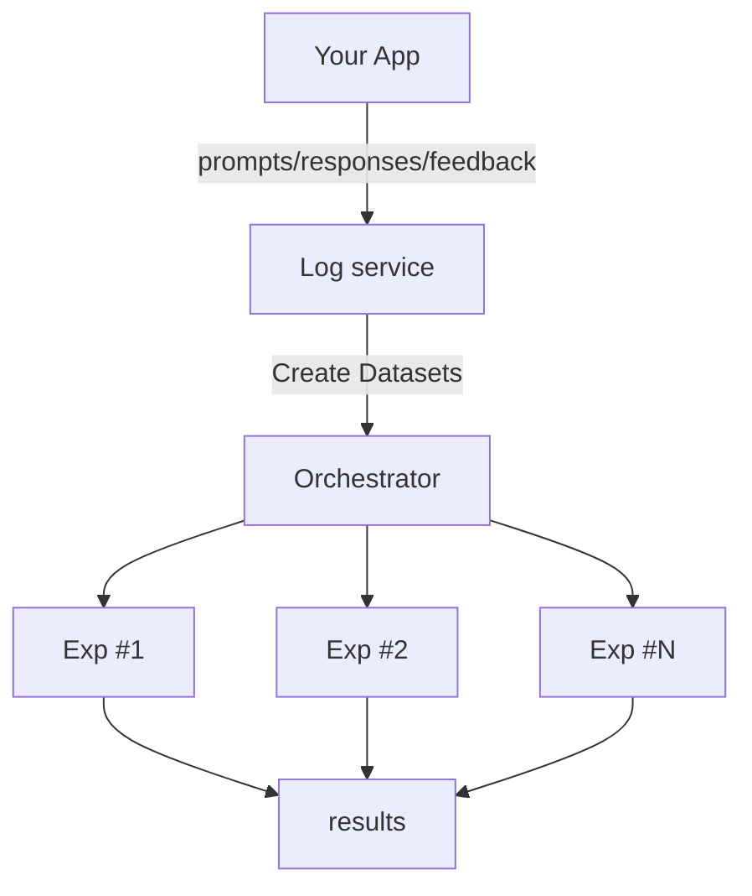
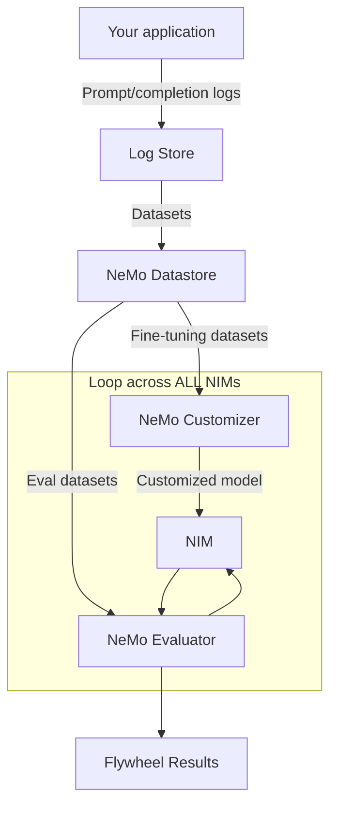

# AI Model Distillation for Financial Data Developer Example

A production-ready developer example demonstrating how to distill large language models into smaller, cost-efficient models for financial workloads using the [NVIDIA Data Flywheel Blueprint](https://developer.nvidia.com/blog/build-efficient-ai-agents-through-model-distillation-with-nvidias-data-flywheel-blueprint/).

Built on NVIDIA NeMo Microservices, this example shows how to automatically fine-tune and evaluate student models for **financial news classification**, achieving teacher-model accuracy while reducing inference costs by up to 98%.

**The purpose of this Developer Example is two-fold:**

1. To provide a working reference implementation demonstrating how to use the Data Flywheel Blueprint for financial services use cases.
1. To educate the community on practical model distillation techniques: what works, what doesn't, and how to apply these methods to your own domain.

You can get started quickly and achieve similar results using your own infrastructure by following the [Quickstart guide](./docs/02-quickstart.md).

- [AI Model Distillation for Financial Data Developer Example](#ai-model-distillation-for-financial-data-developer-example)
  - [Financial Use Case: News Event Classification](#financial-use-case-news-event-classification)
  - [What is a Data Flywheel?](#what-is-a-data-flywheel)
    - [Where the NeMo microservices Come In](#where-the-nemo-microservices-come-in)
  - [How to Use This Developer Example](#how-to-use-this-developer-example)
    - [Preparing your data](#preparing-your-data)
      - [1 – Log schema](#1log-schema)
      - [2 – Instrumenting an application](#2instrumenting-an-application)
      - [3 – Import helpers and customization](#3import-helpers-and-customization)
    - [Real-World Results and What to Expect](#real-world-results-and-what-to-expect)
    - [Additional Reading](#additional-reading)
  - [Technical Details](#technical-details)
    - [Key Features](#key-features)
    - [Design Philosophy](#design-philosophy)
      - [Future Roadmap](#future-roadmap)
    - [Software Components](#software-components)
    - [Workflow Overview](#workflow-overview)
    - [Technical Diagrams](#technical-diagrams)
    - [Minimum System Requirements](#minimum-system-requirements)
    - [Security and Compliance for Financial Services](#security-and-compliance-for-financial-services)
    - [Task Serialization Safeguard](#task-serialization-safeguard)
  - [Next Steps](#next-steps)
  - [Available Customizations](#available-customizations)
  - [Contributing](#contributing)
  - [License](#license)
  - [Disclaimer:](#disclaimer)

## Financial Use Case: News Event Classification

Demonstrates model distillation on financial news headlines classification (13 event categories: market movements, earnings, regulatory changes, etc.).

**What you'll learn:**
- Generate labeled data using teacher model (Llama 3.3 70B)
- Distill to smaller models (Llama 3.2 1B/3B, Llama 3.1 8B)
- Evaluate using F1-score metrics for classification accuracy
- Deploy cost-efficient models matching teacher performance

**Results:**
- 95%+ F1-score with fine-tuned 1B models
- 98% inference cost reduction vs. 70B models
- Automated improvement through production data

## What is a Data Flywheel?

> **Note:** Built on the [NVIDIA Data Flywheel Blueprint](https://developer.nvidia.com/blog/build-efficient-ai-agents-through-model-distillation-with-nvidias-data-flywheel-blueprint/). Code adapted for financial services with F1-score evaluation.

A data flywheel uses production data (LLM logs, feedback, labels) to reduce latency and cost of GenAI systems:



Production traffic flows to a centralized logging service. From there, evaluation and fine-tuning datasets are created for offline experiments. Key decisions include model selection, dataset curation, fine-tuning techniques, and evaluation metrics.

### Where the NeMo microservices Come In

NeMo Microservices provides programmatic control of datasets, fine-tuning, evaluation, and inference. Automates experiment exploration with sensible defaults, surfacing promising candidates for ML engineer analysis.



Automated process using NeMo microservices:

1. Pull data from log store
2. Group by task and de-duplicate
3. Create eval/fine-tuning datasets using stratified splitting for balanced representation
4. Store datasets in NeMo Datastore
5. Launch fine-tuning jobs (NeMo Customizer)
6. Run F1-score evaluations (NeMo Evaluator)

System narrows vast options to manageable promising candidates. Scale across multiple NIMs using NeMo Deployment Manager for dynamic resource allocation.

## How to Use This Developer Example

This implementation uses unconventional but effective techniques:
- Routes production traffic directly to fine-tuning (consider PII removal)
- Uses teacher model responses as ground truth
- No manual labeling required

**This approach works well for:**
- Classification tasks (sentiment, category, routing)
- Structured outputs (tool calling, entity extraction)  
- Domain-specific workflows with consistent patterns

**This approach may not work for:**
- Open-ended creative generation
- Tasks requiring nuanced human judgment
- Highly regulated outputs requiring human review

**To use this developer example:**

1. **Learn from the reference**
   - Deploy with provided financial news dataset
   - Review code and documentation

2. **Prepare your traffic**
   - Instrument production applications with stable `workload_id` tags
   - Export logs to Elasticsearch or use provided connectors

3. **Choose deployment mode**
   - Always-on service for continuous evaluation
   - Ad-hoc runs for periodic analysis

4. **Launch a run**
   - Load tagged traffic into Elasticsearch
   - System handles NIM deployment, evaluation, and fine-tuning

5. **Interpret results**
   - Review F1-scores by student model
   - **base** = zero-shot performance
   - **customized** = post-LoRA fine-tuning performance
   - F1-score ranges:
     - 0.95+ = Production-ready
     - 0.85-0.95 = Review edge cases
     - <0.85 = Needs more data or different architecture
   - Download datasets, LoRA adapters, or artifacts for inspection

6. **Keep human in the loop**
   - Data Flywheel surfaces candidates, humans decide on promotion

7. **Stay updated**
   - Follow repo for UI improvements and new strategies

### Preparing your data

**For this Financial Example:**
- Dataset: Financial news headlines with 13 event categories
- Teacher Model: Llama 3.3 70B Instruct (generates labels)
- Ground Truth: Teacher responses in Elasticsearch
- Evaluation: F1-score comparing student vs. teacher
- Workflow: Base eval → LoRA fine-tuning → Customized eval (parallel per NIM)

**For Your Use Case:**
System needs log location (Elasticsearch index) and document schema. Modify code as needed, or use schemas below.

#### 1&ensp;–&ensp;Log schema

Each Elasticsearch document **must** contain the following top-level keys:

| Field        | Type               | Description                                                         |
|--------------|--------------------|---------------------------------------------------------------------|
| `timestamp`  | `int` (epoch secs) | Time the request was issued                                         |
| `workload_id`| `str`              | Stable identifier for the logical task / route / agent node         |
| `client_id`  | `str`              | Identifier of the application or deployment that generated traffic  |
| `request`    | `dict`             | OpenAI ChatCompletion request format with `model` and `messages`    |
| `response`   | `dict`             | OpenAI ChatCompletion response format with `choices`                |

Example document for financial news classification:

```jsonc
{
  "timestamp": 1715854074,
  "workload_id": "news_classifier",
  "client_id": "news-classifier-5000",
  "request": {
    "model": "meta/llama-3.3-70b-instruct",
    "messages": [
      {
        "role": "system",
        "content": "You are a financial news classifier."
      },
      {
        "role": "user",
        "content": "Classify this headline: Fed signals potential rate cut"
      }
    ]
  },
  "response": {
    "choices": [
      {
        "message": {
          "role": "assistant",
          "content": "Central Bank Decisions"
        }
      }
    ]
  }
}
```

> **Key Points:**
> - `client_id` identifies the data source (e.g., environment, customer)
> - `workload_id` must be unique per task type for independent evaluation
> - Keeping full request/response enables replay and fine-tuning without data loss

#### 2&ensp;–&ensp;Instrumenting an application

Route request/response logs to Elasticsearch or bulk import via `docker-compose`. The snippet below shows how to wrap OpenAI calls:

> For a comprehensive example with LangChain and AIVA, see [AIVA Data Logging Example](./docs/data-logging.md).

```python
# examples/log_to_es.py
import os, time, uuid
from elasticsearch import Elasticsearch
from openai import OpenAI

ES_URL = os.getenv("ELASTICSEARCH_URL", "http://localhost:9200")
ES_INDEX = os.getenv("ES_COLLECTION_NAME", "flywheel")

es = Elasticsearch(hosts=[ES_URL])
openai_client = OpenAI()

CLIENT_ID = "my_demo_app"

# Example agent nodes (each with its own workload_id)
WORKLOADS = {
    "simple_chat": "agent.chat",
    "tool_router": "agent.tool_router",
}

def log_chat(workload_id: str, messages: list[dict]):
    # 1) call the LLM
    response = openai_client.chat.completions.create(
        model="gpt-3.5-turbo",
        messages=messages,
        temperature=0.3,
    )

    # 2) build the document
    doc = {
        "timestamp": int(time.time()),
        "workload_id": workload_id,
        "client_id": CLIENT_ID,
        "request": {
            "model": response.model,
            "messages": messages,
            "temperature": 0.3,
            "max_tokens": 1024,
        },
        "response": response.model_dump(),  # OpenAI python-sdk v1 returns a pydantic model
    }

    # 3) write to Elasticsearch
    es.index(index=ES_INDEX, document=doc, id=str(uuid.uuid4()))

# --- Example usage -----------------------------------------------------------
messages_chat = [{"role": "user", "content": "Hello!"}]
log_chat(WORKLOADS["simple_chat"], messages_chat)

messages_tool = [
    {"role": "user", "content": "Who won the 2024 Super Bowl?"},
    {
        "role": "system",
        "content": "You are a router that decides whether to call the Wikipedia tool or answer directly.",
    },
]
log_chat(WORKLOADS["tool_router"], messages_tool)
```

> **Streaming responses**: Buffer and reconstruct full `response` object before indexing, or modify importer.

#### 3&ensp;–&ensp;Import helpers and customization

Reference implementation includes:
- `src/scripts/load_test_data.py` – Bulk-load JSONL to Elasticsearch
- `src/tasks/tasks.py::create_datasets` – Read logs, deduplicate, create datasets

Swap Elasticsearch for another store if needed; ensure `create_datasets` can retrieve documents in above schema.

### Real-World Results: Financial News Classification

Results from financial news headlines dataset with 13 event categories:

| Dataset Size | Model | Base F1-Score | Customized F1-Score |
|--------------|-------|---------------|---------------------|
| 5K samples | Llama 3.2 1B | 0.36 | 0.85 |
| 10K samples | Llama 3.2 1B | 0.34 | 0.89 |
| 25K samples | Llama 3.2 1B | 0.32 | 0.95 |
| 25K samples | Llama 3.2 3B | 0.72 | 0.95 |

**Key Findings:**
- Fine-tuned 1B models achieve 0.95+ F1-score, matching 70B teacher model performance
- Approximately 98% inference cost reduction by replacing 70B with fine-tuned 1B models
- Performance improves with more training data (flywheel effect)
- Similar cost reductions observed in NVIDIA internal testing (HR chatbot: 98.6% reduction, Qwen-2.5-32b replacing Llama-3.1-70b: 50%+ reduction)

> Techniques demonstrated here apply to other financial workloads: document analysis, compliance checking, trade analysis, customer support.

### Additional Reading

**Data Flywheel Blueprint Documentation:**
* [Complete Documentation Guide](./docs/README.md) - Role-based navigation and comprehensive documentation index

**External Resources:**
* [Enhance Your AI Agent with Data Flywheels Using NVIDIA NeMo Microservices](https://developer.nvidia.com/blog/enhance-your-ai-agent-with-data-flywheels-using-nvidia-nemo-microservices/)
* [Nvidia Releases NeMo Microservices To Streamline AI Agent Development](https://www.forbes.com/sites/janakirammsv/2025/04/25/nvidia-releases-nemo-microservices-to-streamline-ai-agent-development/)
* [Overview of NeMo Microservices](https://docs.nvidia.com/nemo/microservices/latest/about/index.html)
* [Enterprises Onboard AI Teammates Faster With NVIDIA NeMo Tools to Scale Employee Productivity](https://blogs.nvidia.com/blog/nemo-enterprises-ai-teammates-employee-productivity/)

## Technical Details

### Key Features

- Data Collection and Storage:
  - Elasticsearch for logging prompt/completion data
  - MongoDB for API and metadata storage
  - Redis for task queue management
- Model Integration:
  - Support for Meta Llama 3.2 1B Instruct model
  - Configurable context length up to 32768 tokens
- Training and Evaluation:
  - F1-score based evaluation for classification tasks (GENERIC workloads)
  - Base evaluation (zero-shot) and customized evaluation (post-LoRA) workflows
  - LoRA-based fine-tuning support via NeMo Customizer
  - **Automated stratified data splitting** using scikit-learn for balanced representation across financial event categories
  - Parallel processing of multiple student NIMs with automatic resource management
- Deployment Infrastructure:
  - Docker Compose setup for development
  - Celery workers for background processing
  - Health monitoring for core services
- Resource Management:
  - Automatic cleanup of running resources during system shutdown
  - Manual cleanup scripts for maintenance operations
  - Comprehensive error handling and logging

### Design Philosophy

The Data Flywheel Blueprint empowers organizations to accelerate the optimization of AI models for cost and performance. This developer example demonstrates these capabilities using financial services data, providing a practical framework and proven tools to guide your journey toward more efficient, production-ready models.

1. **Reference Implementation for Real-World Impact**
   This developer example demonstrates the capabilities of NeMo Microservices on a financial classification task, providing a foundation you can adapt and extend to meet your specific production requirements.

2. **Streamlined Human Oversight**
   The Flywheel process is designed to minimize manual intervention. Human review is reserved for evaluating candidate models after automated assessments, eliminating the need for ongoing user feedback or manual labeling.

3. **Cost and Latency Optimization**
   The primary focus is on reducing inference costs and latency by distilling larger models into smaller, high-quality alternatives. Future updates will further enhance accuracy and introduce advanced prompt and agent optimization features.

4. **Iterative, Data-Driven Improvement**
   Each iteration provides valuable insights, even when a smaller model is not immediately identified. This iterative approach ensures continuous learning and improvement.

5. **Seamless Integration with Existing Workflows**
   - Designed for teams with existing generative AI applications in production.
   - Easily integrates with your current logging and workload tagging practices.
   - Supports enhanced workload descriptions for improved future classification.
   - Leverages robust infrastructure—including Elasticsearch, MongoDB, Redis, and NeMo microservices—to store data, build datasets, run evaluations, fine-tune models, and re-evaluate results.

To get the most value from this developer example, ensure you have:

- An existing generative AI application in production.
- Logging of prompt/completion traffic, with workload tagging (such as routes, nodes, or agent steps).
- (Optional, but recommended) Descriptive metadata for each workload to support future classification.
- The ability to deploy and operate supporting infrastructure (Elasticsearch, MongoDB, Redis, and NeMo microservices) for data storage, dataset creation, evaluation, and fine-tuning.

By following this developer example, you can confidently advance your AI model optimization initiatives, leveraging a process that is transparent, adaptable, and focused on measurable outcomes.

#### Future Roadmap
The Data Flywheel Blueprint purposely keeps the first release simple. Areas we are actively exploring for future versions include:

| Theme | Example Ideas |
|-------|--------------|
| **Automated Data Collection** | Integrated collection of model inputs/outputs, latency, and metadata |
| **Visualization Dashboards** | Pre-built Grafana/Kibana dashboards for cost, latency, drift and accuracy trends |
| **Agentic Observability & Prompt Insights** | Detect regression, drift, or improvement trends based on performance telemetry |
| **Dynamic Configuration Overrides** | Runtime overrides for config.yaml settings via API or environment variables |
| **Data Governance & Privacy** | PII redaction pipeline support for logs and datasets; fine-grained RBAC on dataset access and usage |
| **Data Governance & Privacy** | Enable experiment tracking tooling for granular tracking of fine-tune runs, metrics, artifacts, and config diffs |
| **Hyper-parameter Sweeps** | Support launching NeMo microservices hyper-parameter sweeps from external tools (e.g. Flywheel) and pulling results back for analysis and visualization | |
| **Smarter Dataset Construction** | Heuristics or LLM-based parsing to derive eval vs. fine-tune splits from logs; support for DPO/KTO pipelines or filtering by thumbs-up/down signal |
| **Model & Backend Extensibility** | Add support for additional NIMs such as Qwen, LLaMA-Nemotron, and Mistral; include testing and evaluation support for quantized models |

### Software Components

The developer example consists of the following implemented components:

- **API Layer**:
  - FastAPI-based REST endpoints (`src/api/endpoints.py`)
  - Data models and schemas (`src/api/models.py`, `src/api/schemas.py`)
  - Job service for task management (`src/api/job_service.py`)
- **Data Storage**:
  - Elasticsearch for log storage
  - MongoDB for API data persistence (`src/api/db.py`)
  - Redis for task queue
- **Task Processing**:
  - Celery workers for background jobs (`src/tasks/tasks.py`)
  - Configurable concurrency and monitoring
- **NeMo Microservices Integration**:
  - Datastore client for dataset management
  - Model evaluation and customization interfaces
  - Configurable NeMo microservices endpoints

### Workflow Overview

The Data Flywheel orchestrates a multi-stage workflow for each job:

1. **Initialize Workflow**: Create flywheel run, LLM judge run, and NIM runs (pending status)
2. **Create Datasets**: Export records from Elasticsearch, identify workload type (GENERIC for financial classification), split into evaluation/training/validation sets, upload to NeMo Datastore
3. **Wait for LLM Judge**: Ensure judge model is ready for evaluation tasks
4. **Process Each NIM** (in parallel):
   - **Spin Up NIM**: Deploy student model and wait for sync
   - **Base Evaluation**: Test zero-shot performance using F1-score metrics
   - **Customization Chain**: Fine-tune with LoRA, then evaluate customized model
   - **Shutdown Deployment**: Clean up NIM resources
5. **Finalize Run**: Update run status, calculate aggregate metrics, log to MLflow

**For GENERIC workloads (like financial classification):**
- Base evaluation compares student model output against teacher ground truth using F1-score
- Customized evaluation uses the same metric after LoRA fine-tuning
- Results show precision and recall for classification accuracy

### Technical Diagrams

For details on the architecture of a Flywheel and the components of this developer example, view the [Architecture Overview](./docs/01-architecture.md).

### Minimum System Requirements

| Requirement Type | Details |
|-------------------------|---------|
| Minimum GPU | **Self-hosted LLM Judge**: 6× (NVIDIA H100, or A100 GPUs)<br>**Remote LLM Judge**: 2× (NVIDIA H100, or A100 GPUs) |
| Cluster | Single-node NVIDIA GPU cluster on Linux with cluster-admin permissions |
| Disk Space | At least 200 GB free |
| Software | Python 3.11<br>Docker Engine<br>Docker Compose v2 |
| Services | Elasticsearch 8.12.2<br>MongoDB 7.0<br>Redis 7.2<br>FastAPI (API server)<br>Celery (task processing) |
| Resource | **Minimum Memory**: 1GB (512MB reserved for Elasticsearch)<br>**Storage**: Varies by log volume/model size<br>**Network**: Ports 8000 (API), 9200 (Elasticsearch), 27017 (MongoDB), 6379 (Redis) |
| Development | Docker Compose for local dev with hot reloading<br>Supports macOS (Darwin) and Linux<br>Optional: GPU support for model inference |
| Production | Kubernetes cluster (recommended)<br>Resources scale with workload<br>Persistent volume support for data storage |

### Security and Compliance for Financial Services

When deploying this example in financial services production environments, consider:

- **Data Privacy**: The reference implementation logs raw production traffic. For financial data, implement PII redaction and data governance controls before production use.
- **Model Validation**: F1-scores measure statistical similarity, not business correctness. Always validate model outputs against compliance requirements.
- **Audit Trails**: All experiments are logged in MLflow. Implement additional audit logging for regulatory compliance.
- **Access Control**: Secure API endpoints, Elasticsearch, and MLflow with appropriate authentication and authorization.

See [SECURITY.md](./SECURITY.md) for reporting security vulnerabilities.

### Task Serialization Safeguard

**Why only one Flywheel run at a time?**  When the Flywheel kicks off a run it may need to spin up **multiple NIMs and customization jobs, each of which can claim one or more GPUs**.  The reference implementation does not yet discover the number of free GPUs in the cluster, so it uses a simple guardrail: **all invocations of `run_nim_workflow_dag` are serialized**.

* The task is bound to a dedicated Celery queue (`parent_queue`). In the `docker-compose.yaml` there is a worker dedicated to this queue whose concurrency is set to `1`. There is a second worker bound to the default `celery` queue which can handle running other tasks (e.g. evals) in parallel.
* Inside the task we wait for the full DAG to complete via `async_result.get(...)` before returning.
* The call to create a job (i.e. `POST /jobs`) will not block, however. It will return immediately with a Job ID

This ensures that only **one** Flywheel experiment can allocate GPUs at any given time, preventing accidental overallocation that would lead to failed NIM deployments or customizations.

**Roadmap** – Automatic GPU introspection and smarter scheduling are planned for a future version of the Blueprint so multiple Flywheel runs can execute in parallel when resources permit.

## Next Steps

### Getting Started
1. **Quick Demo**: Follow the [Quickstart Guide](./docs/02-quickstart.md) to run the financial news classification example
2. **Understand Architecture**: Review the [Architecture Overview](./docs/01-architecture.md)
3. **Find Your Role**: Check the [Audience Guide](./docs/04-audience-guide.md) for role-specific guidance

### Customization
- **Configure for Your Domain**: [Configuration Guide](./docs/03-configuration.md)
- **Integrate Your App**: [Data Logging for AI Apps](./docs/data-logging.md)
- **Understand F1-Score Results**: [Evaluation Types and Metrics](./docs/06-evaluation-types-and-metrics.md)
- **Customize Workflows**: [Workflow Orchestration](./docs/08-workflow-orchestration.md)

### Production Deployment
- **Production Best Practices**: [Limitations & Best Practices](./docs/05-limitations-best-practices.md)
- **Advanced Features**: [NeMo Platform Integration](./docs/09-nemo-platform-integration.md)
- **Kubernetes Deployment**: [Production Deployment Guide](./docs/10-production-deployment.md)
- **Helm Installation**: [Helm Installation](./docs/11-helm-installation.md)
- **Extract Models**: [LoRA Model Extraction](./docs/12-lora-model-extraction.md)

### Complete Documentation
For a full documentation index and role-based reading paths, see [Documentation Guide](./docs/readme.md)

## Available Customizations

The following are some of the customizations that you can make after you complete the steps in the [Quickstart Guide](./docs/02-quickstart.md).

| Category | Description | Available Options |
|----------|-------------|------------------|
| [Environment Variables](docs/03-configuration.md#environment-variables) | Configure system using environment variables | • **Required Variables**: NGC_API_KEY, HF_TOKEN<br>• **Optional Variables**: ES_COLLECTION_NAME, ELASTICSEARCH_URL, MONGODB_URL, REDIS_URL<br>• **Configuration**: Via .env file or system environment |
| [Model Integration](docs/03-configuration.md#model-integration) | Configure and deploy LLM models | • **Currently Supported**: Meta Llama 3.2 1B Instruct<br>• **Context Length**: Up to 32768 tokens<br>• **Hardware Config**: GPU support (configurable), PVC size (configurable)<br>• **Version Control**: Model tags supported |
| [Evaluation Settings](docs/03-configuration.md#evaluation-settings) | Configure data splitting and evaluation parameters | • **Data Split**: Eval size (default: 20), validation ratio (0.1)<br>• **Minimum Records**: 50 records required<br>• **Reproducibility**: Optional random seed<br>• **ICL Settings**: Context length (max 32768), reserved tokens (4096), examples (min 1, max 3)<br>• **Example Selection**: Uniform tool distribution or embedding similarity<br>• **Embedding Support**: Local/remote embedding NIMs for similarity-based selection |
| [Fine-tuning Options](docs/03-configuration.md#fine-tuning-options) | Customize model training | • **Training Type**: SFT (Supervised Fine-Tuning)<br>• **Method**: LoRA with configurable parameters<br>• **Parameters**: epochs (2), batch size (16), learning rate (0.0001)<br>• **LoRA Config**: adapter dimension (32), dropout (0.1) |
| [Data Infrastructure](docs/03-configuration.md#data-infrastructure) | Configure data storage and processing | • **Storage**: Elasticsearch for logs<br>• **Queue**: Redis for task processing<br>• **Database**: MongoDB for API data<br>• **Processing**: Celery workers with configurable concurrency |
| [Deployment Options](docs/03-configuration.md#deployment-options) | Infrastructure configuration | • **Development**: Docker Compose with hot reloading<br>• **Production**: Kubernetes deployment via [Helm charts](docs/11-helm-installation.md)<br>• **Services**: API, Celery Worker, Redis, MongoDB, Elasticsearch<br>• **Resource Config**: Network mode, volume mounts, health checks<br>• **Environment**: Configurable URLs and API keys |

Refer to the [Configuration Guide](./docs/03-configuration.md) for more information.

## Contributing

1. Install development dependencies:

   ```sh
   uv sync --dev
   ```

   This command installs all dependencies needed to build the container and run the tests.

2. Start required services:

   ```sh
   ./scripts/run.sh
   ```

   This starts the necessary services via docker compose that are required for testing.

3. Run the tests:

   - For unit tests (requires MongoDB from docker compose):

     ```sh
     uv run pytest
     ```

   - For integration tests (with mocked NeMo microservices components):

     ```sh
     uv run pytest -m integration
     ```

4. Clean up after development:

   - Stop all services:

     ```sh
     ./scripts/stop.sh
     ```

   - (Optional) Clear all database volumes:

     ```sh
     ./scripts/clear_all_volumes.sh
     ```

If you modify the API, regenerate the openapi.json with the following command:

```sh
uv run python scripts/generate_openapi.py
```

## License

This NVIDIA AI BLUEPRINT is licensed under the [Apache License, Version 2.0.](./LICENSE) This project will download and install additional third-party open source software projects and containers. Review [the license terms of these open source projects](./LICENSE-3rd-party.txt) before use.

The software and materials are governed by the NVIDIA Software License Agreement (found at https://www.nvidia.com/en-us/agreements/enterprise-software/nvidia-software-license-agreement/) and the Product-Specific Terms for NVIDIA AI Products (found at https://www.nvidia.com/en-us/agreements/enterprise-software/product-specific-terms-for-ai-products/), except that models are governed by the AI Foundation Models Community License Agreement (found at NVIDIA Agreements | Enterprise Software | NVIDIA Community Model License) and NVIDIA dataset is governed by the NVIDIA Asset License Agreement found [here](./LICENSE-dataset).

For Meta/llama-3.1-70b-instruct model the Llama 3.1 Community License Agreement, for nvidia/llama-3.2-nv-embedqa-1b-v2model the Llama 3.2 Community License Agreement, and for the nvidia/llama-3.2-nv-rerankqa-1b-v2 model the Llama 3.2 Community License Agreement. Built with Llama.

## Disclaimer:

The Data Flywheel Blueprint is shared as reference and is provided "as is". The security in the production environment is the responsibility of the end users deploying it. When deploying in a production environment, please have security experts review any potential risks and threats; define the trust boundaries, implement logging and monitoring capabilities,secure the communication channels, integrate AuthN & AuthZ with appropriate controls.
