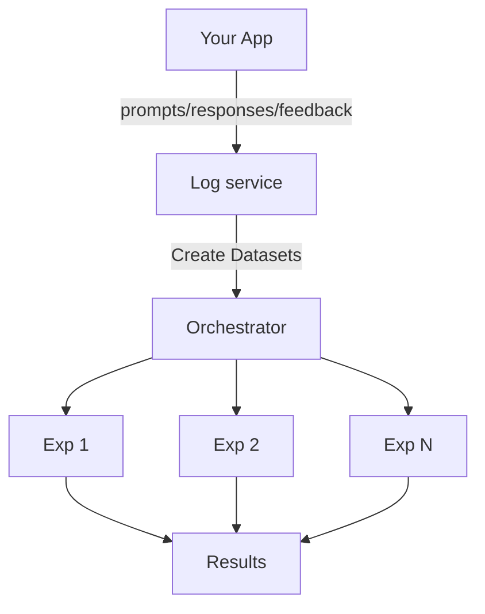
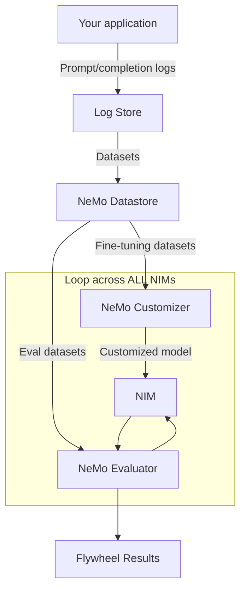

# AI Model Distillation for Financial Data Developer Example

> **Note:** This is a financial services variant of the NVIDIA Data Flywheel Foundational Blueprint, specifically configured for financial news classification workloads with F1-score evaluation. The underlying architecture and core functionality remain based on the Data Flywheel Blueprint.

**Deploy a production-grade Data Flywheel service** that uses NVIDIA NeMo Microservices to continuously discover and promote more efficient models for financial data analysis. Get started in minutes: [Quickstart Guide](./docs/02-quickstart.md)

## What This Does

Automates model distillation for financial classification tasks. The system:

- Collects production prompt/response logs from your applications
- Creates evaluation and training datasets automatically
- Fine-tunes smaller models (LoRA) and evaluates them against teacher models
- Reports F1-scores to identify cost-effective alternatives

**Key Differentiator**: Optimized for classification workloads using F1-score evaluation, ideal for financial news classification, sentiment analysis, and risk prediction.

### Core Components

- **NeMo Customizer**: LoRA-based fine-tuning
- **NeMo Evaluator**: Automated F1-score evaluation for classification
- **NeMo Datastore**: Dataset and artifact management
- **NeMo Deployment Manager**: Dynamic NIM deployment for inference

Each microservice runs as a Docker container, orchestrated through Kubernetes for consistent deployment.

---

## Use Case: Capital Markets

**For**: Quantitative researchers, AI developers, and enterprise data scientists working with financial text classification.

**Problem**: LLM adoption in finance is constrained by cost, latency, and integration complexity. Financial markets require continuous model optimization as data sources evolve.

**Solution**: Automatically distill large teacher models (49B, 70B) into smaller student models (1B, 3B, 8B) that maintain high F1-scores (0.90-0.95) on domain-specific classification tasks.

### Key Capabilities

- **Model distillation**: Reduce inference costs by 50-98% while maintaining classification accuracy
- **Rapid iteration**: Automate fine-tuning and evaluation for backtesting workflows
- **Experiment tracking**: Built-in evaluation metrics and artifact management
- **Flexible deployment**: Deploy alongside existing NIMs across on-premises, cloud, and edge environments

---

## What is a Data Flywheel?

A data flywheel uses production application data (prompt/response logs, user feedback, labels) to automatically improve model accuracy and reduce inference costs. Flow:



Production traffic from your application is routed to a centralized logging service. From there, evaluation and fine-tuning datasets are created and used in a series of offline experiments. Anyone who has done this manually knows there are a lot of options to consider when designing the experiments, and many of them depend on the kinds of data you have:

- Which models do you pick?
- In what ways do you curate your datasets?
- Which fine-tuning techniques do you try?
- Which metrics do you use in evals?

It's a lot to decide on. Enter: The NeMo Microservice Platform.

### How NeMo Microservices Automate This

NeMo Microservices provide programmatic control of datasets, fine-tuning, evaluation, and inference. Instead of manual experiment management, the system automatically explores configurations and presents promising candidates for review.



In just a few hours, this automated process built on top of NeMo microservices can:

1. Pull data from your log store.
2. Group it by task (for example, if you have an agent doing multiple things, each node is a different task).
3. De-dup it.
4. Create eval and fine-tuning datasets from your production traffic using **class-aware stratified splitting** to ensure balanced representation across tool types, and store them in NeMo Datastore.
5. Kick off fine-tuning jobs with NeMo Customizer.
6. Run evaluations with appropriate metrics (F1-score for classification, LLM-as-judge for tool calling) on NeMo Evaluator.

With reasonable defaults, the system automatically narrows a vast number of possible options down to a manageable set of promising candidates for further analysis—no manual experiment design required.

**👆 This is the key insight of the Data Flywheel Blueprint built on top of NeMo microservices**.

You can scale this process across any number of NIMs by using NeMo Deployment Manager to dynamically start and stop NIMs as needed, so you don't have to keep every NIM running at all times. This cycle can be repeated as frequently as desired: daily, weekly, or on your own schedule.

Data Flywheels are a fledgling concept in Generative AI, but already real-world tests within NVIDIA have identified instances where **using a flywheel can reduce inference costs by up to 98.6%**. There are caveats to this which we discuss below, but we believe these early data points warrant attention.

---

## Differences from the Data Flywheel Foundational Blueprint

This financial services variant is optimized for classification workloads. Key differences:

| Aspect | Data Flywheel Blueprint | Financial Services Variant |
|--------|------------------------|---------------------------|
| **Default Workload Type** | `"auto"` | `"classification"` |
| **Evaluation Metric** | LLM-as-judge similarity | F1-score |
| **Default Eval Size** | 20 | 100 |
| **Default Namespace** | `"dfwbp"` | `"dfwfd"` |
| **Primary Use Case** | Tool-calling, agent routing | Financial news classification |
| **Score Interpretation** | Semantic similarity | Classification accuracy |

<details>
<summary>📋 Detailed Configuration Differences (click to expand)</summary>

### 1. Evaluation Metrics: F1-Score for Classification

**Original Blueprint**: Uses LLM-as-judge similarity metrics (range `[0, 1]`) for tool-calling workloads.  
**Financial Variant**: Uses F1-score for classification workloads. Evaluates by comparing classification labels against ground truth.

**Impact**: Results show F1-scores instead of similarity scores. Higher F1-scores (closer to 1.0) indicate better classification accuracy.

### 2. Workload Type Configuration

**Original Blueprint**: Default `workload_type: "auto"` (auto-detects based on data).  
**Financial Variant**: Default `workload_type: "classification"` in `config/config.yaml`. Still supports tool-calling when configured.

**Configuration**: `config/config.yaml` → `evaluation_config.workload_type: "classification"`

### 3. Evaluation Dataset Size

**Original Blueprint**: Default `eval_size: 20` examples.  
**Financial Variant**: Default `eval_size: 100` examples for more robust classification assessment.

**Configuration**: `config/config.yaml` → `data_split_config.eval_size: 100`

### 4. Namespace Configuration

**Original Blueprint**: Default namespace `"dfwbp"` (Data Flywheel Blueprint).  
**Financial Variant**: Default namespace `"dfwfd"` (Data Flywheel Financial Distillation).

**Configuration**: `config/config.yaml` → `nmp_config.nmp_namespace: "dfwfd"`

### 5. Use Case Focus

**Original Blueprint**: General-purpose agent workloads, tool-calling (e.g., HR chatbot).  
**Financial Variant**: Financial news classification (e.g., "Analyst Rating", "Stock price movement", "Regulatory"). Designed for alpha research and risk prediction.

### 6. Model Evaluation Approach

**Original Blueprint**: Compares responses using LLM-as-judge similarity.  
**Financial Variant**: Compares classification labels using F1-score. Uses teacher model responses as ground truth.

### 7. Score Interpretation

**Original Blueprint**: Scores are similarity metrics `[0, 1]` indicating semantic similarity.  
**Financial Variant**: Scores are F1-scores `[0, 1]` indicating classification accuracy (balances precision and recall).

**Note:** All differences are configurable. Switch back to tool-calling by setting `workload_type: "tool_calling"` or use auto-detection with `workload_type: "auto"`.

</details>

---

## How to Use This Blueprint

### Quick Start

1. **Learn the system**: Follow the [Quickstart Guide](./docs/02-quickstart.md) to deploy and run with sample data
2. **Instrument your app**: Tag LLM calls with stable `workload_id` and log prompt/response pairs
3. **Load data**: Push logs to Elasticsearch (or use the Flywheel API)
4. **Run experiments**: Launch a job; the system automatically creates datasets, fine-tunes, and evaluates
5. **Review results**: Check F1-scores grouped by NIM; download promising models for inspection

### Understanding Results

Results are grouped by NIM with two experiment types:
- **base-eval**: Zero-shot F1-score baseline (before customization)
- **customized-eval**: F1-score after fine-tuning

**For classification workloads** (default): F1-scores range `[0, 1]`. Look for high-scoring small models (F1-score closer to 1.0), then download datasets, LoRA adapters, or model artifacts.

**For tool-calling workloads**: Scores include function name accuracy, function name and arguments accuracy, and optionally LLM-as-judge correctness.

### Important Notes

This implementation uses some non-standard approaches:
- Routes production traffic directly into fine-tuning (no PII removal)
- Builds evaluation datasets from production model responses (no separate ground truth)
- No hand-labeling required

**Human oversight required**: The Flywheel identifies candidates; promotion to production and deeper evaluation remain human decisions.

<details>
<summary>📋 Data Preparation Details (click to expand)</summary>

The Flywheel uses production **prompt/completion logs** as the source of truth. It needs to know where to find logs (e.g., Elasticsearch index) and document structure.

### Log Schema

Each Elasticsearch document **must** contain the following top-level keys:

| Field        | Type               | Description                                                         |
|--------------|--------------------|---------------------------------------------------------------------|
| `timestamp`  | `int` (epoch secs) | Time the request was issued                                         |
| `workload_id`| `str`              | Stable identifier for the logical task / route / agent node         |
| `client_id`  | `str`              | Identifier of the application or deployment that generated traffic  |
| `request`    | `dict`             | Exact [`openai.ChatCompletion.create`](https://platform.openai.com/docs/api-reference/chat/create) payload received by the model |
| `response`   | `dict`             | Exact `ChatCompletion` response returned by the model               |

**For classification workloads** (financial services variant default), the response content should contain classification labels wrapped in double square brackets:

```jsonc
{
  "timestamp": 1715854074,
  "workload_id": "news_classifier",
  "client_id": "financial-news-dataset",
  "request": {
    "model": "meta/llama-3.3-70b-instruct",
    "messages": [
      {
        "role": "system",
        "content": "You are a financial news classifier."
      },
      {
        "role": "user",
        "content": "Mid-Afternoon Market Update: Dow Up Over 200 Points; Lakeland Industries Shares Spike Higher"
      }
    ]
  },
  "response": {
    "choices": [
      {
        "message": {
          "role": "assistant",
          "content": "[[[Stock price movement]]]"
        }
      }
    ]
  }
}
```

*Why this shape?* Keeping the full request/response allows the Flywheel to replay prompts, build few-shot demonstrations, and fine-tune without lossy conversions. For classification workloads, labels wrapped in `[[[...]]]` in the response content are extracted by NeMo Evaluator as ground truth for F1-score evaluation.

> **Tagging matters** • `client_id` is meant to identify *who* produced the traffic (for example a specific micro-service, environment, or customer). Multiple workloads can share the same `client_id`.
> **`workload_id` is much stricter:** it represents a single *type* of request. If your application is an agent with several nodes you **must assign a different `workload_id` to every node** so the Flywheel can evaluate them independently. Treat it as the primary key for slicing, deduplication, and dataset creation.

#### 2 – Instrumenting an application

If you already write request/response logs, you can either route that traffic to a production Elasticsearch instance that you manage or bulk import them into the Elasticsearch instance started by `docker-compose`. For new projects the snippet below shows how a **synchronous** OpenAI call can be wrapped so every interaction is written in the expected format.

> 💡 For a more comprehensive example of instrumenting an application using LangChain with an AI Virtual Assistant (AIVA), see our [Data Logging Guide](./docs/data-logging.md).

```python
# examples/log_to_es.py
import os, time, uuid
from elasticsearch import Elasticsearch
from openai import OpenAI

ES_URL = os.getenv("ELASTICSEARCH_URL", "http://localhost:9200")
ES_INDEX = os.getenv("ES_COLLECTION_NAME", "flywheel")

es = Elasticsearch(hosts=[ES_URL])
openai_client = OpenAI()

CLIENT_ID = "financial_news_app"

# Example workload for financial news classification
WORKLOAD_ID = "news_classifier"

def log_classification(workload_id: str, messages: list[dict]):
    # 1) call the LLM
    response = openai_client.chat.completions.create(
        model="meta/llama-3.3-70b-instruct",
        messages=messages,
        temperature=0.3,
    )

    # 2) build the document
    doc = {
        "timestamp": int(time.time()),
        "workload_id": workload_id,
        "client_id": CLIENT_ID,
        "request": {
            "model": response.model,
            "messages": messages,
            "temperature": 0.3,
            "max_tokens": 1024,
        },
        "response": response.model_dump(),  # OpenAI python-sdk v1 returns a pydantic model
    }

    # 3) write to Elasticsearch
    es.index(index=ES_INDEX, document=doc, id=str(uuid.uuid4()))

# --- Example usage -----------------------------------------------------------
messages = [
    {"role": "system", "content": "You are a financial news classifier."},
    {"role": "user", "content": "Analyst: Chipotle Is Successful Because It Sticks To What Works"}
]
log_classification(WORKLOAD_ID, messages)
```

💡 **Streaming responses**: If using streaming mode, buffer the stream and reconstruct a full `response` object before indexing, or modify the Flywheel importer.

### Import Helpers

The reference implementation includes:
- `src/scripts/load_test_data.py` – CLI to bulk-load JSONL into the Flywheel index
- `src/tasks/tasks.py::create_datasets` – Celery task that reads logs, deduplicates, and creates evaluation & training datasets

You can swap Elasticsearch for another store; ensure `create_datasets` can retrieve documents in the schema above.

</details>

### Real-World Results

Real-world tests within NVIDIA show **cost reductions of up to 98.6%** while maintaining comparable accuracy. Example: An internal HR chatbot using `llama-3.1-70b-instruct` for tool calling was able to replace it with a fine-tuned `llama-3.2-1b-instruct` achieving ~98% accuracy.

**For financial services classification**: With sufficient training data (25,000 examples), student models (1B, 3B, 8B) achieve F1-scores of 0.90-0.95 relative to teacher models (49B, 70B), enabling significant cost savings while maintaining classification accuracy.

### Additional Reading

**Data Flywheel Blueprint Documentation:**
* [Complete Documentation Guide](./docs/README.md) - Role-based navigation and comprehensive documentation index

**External Resources:**
* [Scale Financial Data Workflows With AI Model Distillation Using the NVIDIA Data Flywheel Blueprint](https://developer.nvidia.com/blog/) - Technical blog post covering this financial services variant
* [Enhance Your AI Agent with Data Flywheels Using NVIDIA NeMo Microservices](https://developer.nvidia.com/blog/enhance-your-ai-agent-with-data-flywheels-using-nvidia-nemo-microservices/) - General Data Flywheel Blueprint overview
* [Overview of NeMo Microservices](https://docs.nvidia.com/nemo/microservices/latest/about/index.html) - NeMo Microservices Platform documentation
* [Enterprises Onboard AI Teammates Faster With NVIDIA NeMo Tools to Scale Employee Productivity](https://blogs.nvidia.com/blog/nemo-enterprises-ai-teammates-employee-productivity/) - Enterprise use cases

<details>
<summary>🔧 Technical Details (click to expand)</summary>

## Technical Details

### Key Features

**Data Collection and Storage**:
- Elasticsearch for logging prompt/completion data
- MongoDB for API and metadata storage
- Redis for task queue management

**Model Integration**:
- Support for Meta Llama 3.2 1B Instruct (configurable for 3B, 8B variants)
- Configurable context length (default: 8192 tokens, maximum: 32768 tokens)

**Training and Evaluation**:
- In-context learning (ICL) with configurable parameters
- LoRA-based fine-tuning support
- Automated stratified data splitting using scikit-learn for balanced datasets
- F1-score evaluation for classification workloads (default)

**Deployment Infrastructure**:
- Docker Compose setup for development
- Celery workers for background processing
- Health monitoring for core services

**Resource Management**:
- Automatic cleanup of running resources during system shutdown
- Manual cleanup scripts for maintenance operations
- Comprehensive error handling and logging

### Design Philosophy

The Data Flywheel Foundational Blueprint empowers organizations to accelerate the optimization of AI models for cost and performance. Rather than offering a one-size-fits-all solution, this blueprint provides a practical framework and proven tools to guide your journey toward more efficient, production-ready models.

1. **Reference Implementation for Real-World Impact**
   This blueprint demonstrates the capabilities of NeMo Microservices, providing a foundation you can adapt and extend to meet your specific production requirements.

2. **Streamlined Human Oversight**
   The Flywheel process is designed to minimize manual intervention. Human review is reserved for evaluating candidate models after automated assessments, eliminating the need for ongoing user feedback or manual labeling.

3. **Cost and Latency Optimization**
   The primary focus is on reducing inference costs and latency by distilling larger models into smaller, high-quality alternatives. Future updates will further enhance accuracy and introduce advanced prompt and agent optimization features.

4. **Iterative, Data-Driven Improvement**
   Each iteration provides valuable insights, even when a smaller model is not immediately identified. This iterative approach ensures continuous learning and improvement.

5. **Seamless Integration with Existing Workflows**
   - Designed for teams with existing generative AI applications in production.
   - Easily integrates with your current logging and workload tagging practices.
   - Supports enhanced workload descriptions for improved future classification.
   - Leverages robust infrastructure—including Elasticsearch, MongoDB, Redis, and NeMo microservices—to store data, build datasets, run evaluations, fine-tune models, and re-evaluate results.

To get the most value from the Data Flywheel Foundational Blueprint, ensure you have:

- An existing generative AI application in production.
- Logging of prompt/completion traffic, with workload tagging (such as routes, nodes, or agent steps).
- (Optional, but recommended) Descriptive metadata for each workload to support future classification.
- The ability to deploy and operate supporting infrastructure (Elasticsearch, MongoDB, Redis, and NeMo microservices) for data storage, dataset creation, evaluation, and fine-tuning.

By following this blueprint, you can confidently advance your AI model optimization initiatives, leveraging a process that is transparent, adaptable, and focused on measurable outcomes.

#### Future Roadmap
The blueprint purposely keeps the first release simple. Areas we are actively exploring for future versions include:

| Theme | Example Ideas |
|-------|--------------|
| **Automated Data Collection** | Integrated collection of model inputs/outputs, latency, and metadata |
| **Visualization Dashboards** | Pre-built Grafana/Kibana dashboards for cost, latency, drift and accuracy trends |
| **Agentic Observability & Prompt Insights** | Detect regression, drift, or improvement trends based on performance telemetry |
| **Dynamic Configuration Overrides** | Runtime overrides for config.yaml settings via API or environment variables |
| **Data Governance & Privacy** | PII redaction pipeline support for logs and datasets; fine-grained RBAC on dataset access and usage |
| **Data Governance & Privacy** | Enable experiment tracking tooling for granular tracking of fine-tune runs, metrics, artifacts, and config diffs |
| **Hyper-parameter Sweeps** | Support launching NeMo microservices hyper-parameter sweeps from external tools (e.g. Flywheel) and pulling results back for analysis and visualization |
| **Smarter Dataset Construction** | Heuristics or LLM-based parsing to derive eval vs. fine-tune splits from logs; support for DPO/KTO pipelines or filtering by thumbs-up/down signal |
| **Model & Backend Extensibility** | Add support for additional NIMs such as Qwen, LLaMA-Nemotron, and Mistral; include testing and evaluation support for quantized models |

### Software Components

The blueprint consists of the following implemented components:

- **API Layer**:
  - FastAPI-based REST endpoints (`src/api/endpoints.py`)
  - Data models and schemas (`src/api/models.py`, `src/api/schemas.py`)
  - Job service for task management (`src/api/job_service.py`)
- **Data Storage**:
  - Elasticsearch for log storage
  - MongoDB for API data persistence (`src/api/db.py`)
  - Redis for task queue
- **Task Processing**:
  - Celery workers for background jobs (`src/tasks/tasks.py`)
  - Configurable concurrency and monitoring
- **NeMo Microservices Integration**:
  - Datastore client for dataset management
  - Model evaluation and customization interfaces
  - Configurable NeMo microservices endpoints

### Technical Diagrams

For details on the architecture of a Flywheel and the components of this Blueprint, view the [Architecture Overview](./docs/01-architecture.md).

### Minimum System Requirements

| Requirement Type | Details |
|-------------------------|---------|
| Minimum GPU | **Classification workloads** (default): 2× (NVIDIA H100, A100, H200, or B200 GPUs)<br>**Tool-calling workloads with LLM-as-judge**: 6× (NVIDIA H100 or A100 GPUs) |
| Cluster | Single-node NVIDIA GPU cluster on Linux with cluster-admin permissions |
| Disk Space | At least 200 GB free (500 GB required for Minikube deployments) |
| Software | Python 3.10+<br>Docker Engine<br>Docker Compose v2 |
| Services | Elasticsearch 8.12.2<br>MongoDB 7.0<br>Redis 7.2<br>FastAPI (API server)<br>Celery (task processing) |
| Resource | **Minimum Memory**: 1GB (512MB reserved for Elasticsearch)<br>**Storage**: Varies by log volume/model size<br>**Network**: Ports 8000 (API), 9200 (Elasticsearch), 27017 (MongoDB), 6379 (Redis) |
| Development | Docker Compose for local dev with hot reloading<br>Supports macOS (Darwin) and Linux<br>Optional: GPU support for model inference |
| Production | Kubernetes cluster (recommended)<br>Resources scale with workload<br>Persistent volume support for data storage |

### Task Serialization Safeguard 🌐

**Why only one Flywheel run at a time?** When the Flywheel kicks off a run it may need to spin up **multiple NIMs and customization jobs, each of which can claim one or more GPUs**. The reference implementation does not yet discover the number of free GPUs in the cluster, so it uses a simple guardrail: **all invocations of `run_nim_workflow_dag` are serialized**.

* The task is bound to a dedicated Celery queue (`parent_queue`). In the `docker-compose.yaml` there is a worker dedicated to this queue whose concurrency is set to `1`. There is a second worker bound to the default `celery` queue which can handle running other tasks (e.g. evals) in parallel.
* Inside the task we wait for the full DAG to complete via `async_result.get(...)` before returning.
* The call to create a job (i.e. `POST /jobs`) will not block, however. It will return immediately with a Job ID

This ensures that only **one** Flywheel experiment can allocate GPUs at any given time, preventing accidental overallocation that would lead to failed NIM deployments or customizations.

**Roadmap** – Automatic GPU introspection and smarter scheduling are planned for a future version of the Blueprint so multiple Flywheel runs can execute in parallel when resources permit.

</details>

## Next Steps

- Review the [Architecture Overview](./docs/01-architecture.md)
- Follow the [Quickstart Guide](./docs/02-quickstart.md) to deploy this blueprint
- Read the [Configuration Guide](./docs/03-configuration.md) for detailed setup options
- Understand your role with the [Audience Guide](./docs/04-audience-guide.md)
- Review [Limitations & Best Practices](./docs/05-limitations-best-practices.md) before promoting any model
- Learn about [Evaluation Types and Metrics](./docs/06-evaluation-types-and-metrics.md)
- Integrate with the [API Reference](./docs/07-api-reference.md) for programmatic access
- Understand [Workflow Orchestration](./docs/08-workflow-orchestration.md) for debugging and customization
- Explore [NeMo Platform Integration](./docs/09-nemo-platform-integration.md) for advanced features
- Deploy in production using the [Production Deployment Guide](./docs/10-production-deployment.md)
- Set up Kubernetes with [Helm Installation](./docs/11-helm-installation.md)
- Extract models using [LoRA Model Extraction](./docs/12-lora-model-extraction.md)

<details>
<summary>⚙️ Available Customizations (click to expand)</summary>

## Available Customizations

After completing the [Quickstart Guide](./docs/02-quickstart.md), you can customize:

| Category | Key Options |
|----------|-------------|
| **Environment Variables** | Required: `NGC_API_KEY`, `NVIDIA_API_KEY`<br>Optional: `ES_COLLECTION_NAME`, `ELASTICSEARCH_URL`, `MONGODB_URL`, `REDIS_URL` |
| **Model Integration** | Meta Llama 3.2 1B/3B/8B Instruct<br>Context length: 8192-32768 tokens<br>GPU support, PVC size configurable |
| **Evaluation Settings** | Eval size: 100 (default for financial variant)<br>Workload type: Classification (default), tool_calling, or auto-detect<br>ICL: Context length, reserved tokens, examples (1-3) |
| **Fine-tuning Options** | LoRA: epochs (1), batch size (64), learning rate (0.0001)<br>Adapter dimension (16), dropout (0.1) |
| **Data Infrastructure** | Elasticsearch (logs), Redis (queue), MongoDB (API data)<br>Celery workers with configurable concurrency |
| **Deployment Options** | Docker Compose (dev) or Kubernetes via [Helm charts](docs/11-helm-installation.md) |

Refer to the [Configuration Guide](./docs/03-configuration.md) for complete details.

</details>

<details>
<summary>🤝 Contributing (click to expand)</summary>

## Contributing

1. **Install dependencies**: `uv sync --dev`
2. **Start services**: `./scripts/run.sh` (starts required Docker Compose services)
3. **Run tests**:
   - Unit tests: `uv run pytest` (requires MongoDB)
   - Integration tests: `uv run pytest -m integration` (mocked NeMo microservices)
4. **Clean up**: `./scripts/stop.sh` (optional: `./scripts/clear_all_volumes.sh`)

**API changes**: Regenerate OpenAPI spec with `uv run python scripts/generate_openapi.py`

</details>

<details>
<summary>📄 License & Disclaimer (click to expand)</summary>

## License

This NVIDIA AI BLUEPRINT is licensed under the [Apache License, Version 2.0](./LICENSE). This project downloads and installs additional third-party open source software projects and containers. Review [the license terms](./LICENSE-3rd-party.txt) before use.

The software and materials are governed by:
- NVIDIA Software License Agreement: https://www.nvidia.com/en-us/agreements/enterprise-software/nvidia-software-license-agreement/
- Product-Specific Terms for NVIDIA AI Products: https://www.nvidia.com/en-us/agreements/enterprise-software/product-specific-terms-for-ai-products/
- Models: AI Foundation Models Community License Agreement
- Dataset: NVIDIA Asset License Agreement ([LICENSE-dataset](./LICENSE-dataset))

**Model-specific licenses**:
- Meta/llama-3.1-70b-instruct: Llama 3.1 Community License Agreement
- nvidia/llama-3.2-nv-embedqa-1b-v2: Llama 3.2 Community License Agreement
- nvidia/llama-3.2-nv-rerankqa-1b-v2: Llama 3.2 Community License Agreement

## Disclaimer

The Data Flywheel Blueprint is shared as reference and provided "as is". Production security is the responsibility of end users. When deploying in production:
- Have security experts review potential risks and threats
- Define trust boundaries
- Implement logging and monitoring capabilities
- Secure communication channels
- Integrate AuthN & AuthZ with appropriate controls

</details>
