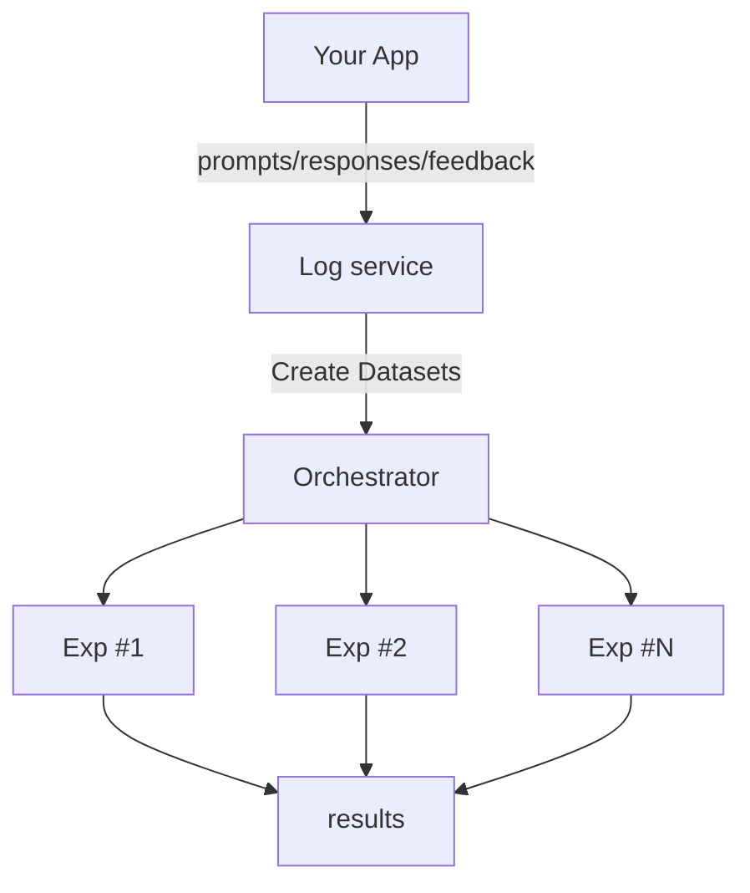
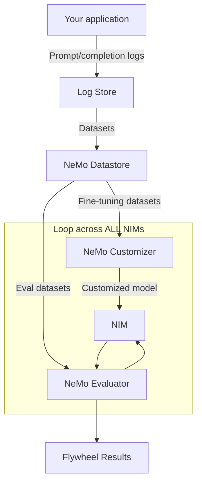

# AI Model Distillation for Financial Data Developer Example

A production-ready developer example demonstrating how to distill large language models into smaller, cost-efficient models for financial workloads using the [NVIDIA Data Flywheel Blueprint](https://developer.nvidia.com/blog/build-efficient-ai-agents-through-model-distillation-with-nvidias-data-flywheel-blueprint/).

Built on NVIDIA NeMo Microservices, this example shows how to automatically fine-tune and evaluate student models for **financial news classification**, achieving teacher-model accuracy while reducing inference costs by up to 98%.

**The purpose of this Developer Example is two-fold:**

1. To provide a working reference implementation demonstrating how to use the Data Flywheel Blueprint for financial services use cases.
1. To educate the community on practical model distillation techniques: what works, what doesn't, and how to apply these methods to your own domain.

You can get started quickly and achieve similar results using your own infrastructure by following the [Quickstart guide](./docs/02-quickstart.md).


- [Financial Use Case: News Event Classification](#financial-use-case-news-event-classification)
- [What is a Data Flywheel?](#what-is-a-data-flywheel)
- [How to Use This Developer Example](#how-to-use-this-developer-example)
- [Real-World Results: Financial News Classification](#real-world-results-financial-news-classification)
- [Technical Details](#technical-details)
- [Next Steps](#next-steps)
- [Contributing](#contributing)
- [License](#license)
- [Disclaimer](#disclaimer)


## Financial Use Case: News Event Classification

Demonstrates model distillation on financial news headlines classification (13 event categories: market movements, earnings, regulatory changes, etc.).

**The Workflow:**
- Teacher: Generate labeled data using Llama 3.3 Nemotron 49B (or Llama 3.3 70B).
- Distill: Transfer knowledge to smaller models (Llama 3.2 1B/3B, Llama 3.1 8B).
- Evaluate: Use F1-score metrics to measure classification accuracy.
- Deploy: Serve cost-efficient models matching teacher performance.

## What is a Data Flywheel?

> **Note:** Built on the [NVIDIA Data Flywheel Blueprint](https://developer.nvidia.com/blog/build-efficient-ai-agents-through-model-distillation-with-nvidias-data-flywheel-blueprint/). Code adapted for financial services with F1-score evaluation.

A data flywheel uses production data (LLM logs, feedback, labels) to reduce latency and cost of GenAI systems:



Production traffic flows to a centralized logging service. From there, evaluation and fine-tuning datasets are created for offline experiments. Key decisions include model selection, dataset curation, fine-tuning techniques, and evaluation metrics.

### Where the NeMo microservices Come In

NeMo Microservices provides programmatic control of datasets, fine-tuning, evaluation, and inference. Automates experiment exploration with sensible defaults, surfacing promising candidates for further analysis.



Automated process using NeMo microservices:

1. Ingest: Pull data from log store and de-duplicate by task.
2. Curate: Create eval/fine-tuning datasets using stratified splitting for balanced representation.
3. Store: Manage datasets in NeMo Datastore.
4. Train: Launch fine-tuning jobs (NeMo Customizer using LoRA).
5. Score: Run F1-score evaluations (NeMo Evaluator).

## How to Use This Developer Example

This implementation uses an effective approach: routing production traffic to fine-tuning, using teacher model responses as ground truth, with no manual labeling required. This works well for classification tasks, structured outputs, and domain-specific workflows with consistent patterns, but may not suit open-ended creative generation or highly regulated outputs requiring human review.

**To get started:** Follow the [Quickstart Guide](./docs/02-quickstart.md) to deploy with the provided financial news dataset and see the workflow in action.

**To adapt for your use case:** Learn how to instrument your application and prepare your data by reading the [Data Logging Guide](./docs/data-logging.md). This covers the required log schema, application instrumentation examples, and data preparation steps.

### Real-World Results: Financial News Classification

Results from financial news headlines dataset with 13 event categories:

| Dataset Size | Model | Base F1-Score | Customized F1-Score |
|--------------|-------|---------------|---------------------|
| 5K samples | Llama 3.2 1B | 0.36 | 0.85 |
| 10K samples | Llama 3.2 1B | 0.34 | 0.89 |
| 25K samples | Llama 3.2 1B | 0.32 | 0.95 |
| 25K samples | Llama 3.2 3B | 0.72 | 0.95 |

**Key Findings:**
- Fine-tuned 1B models achieve 0.95+ F1-score, matching 70B teacher model performance
- Approximately 98% inference cost reduction by replacing 70B with fine-tuned 1B models
- Performance improves with more training data (flywheel effect)
- Similar cost reductions observed in NVIDIA internal testing (HR chatbot: 98.6% reduction, Qwen-2.5-32b replacing Llama-3.1-70b: 50%+ reduction)

> Techniques demonstrated here apply to other financial workloads: document analysis, compliance checking, trade analysis, customer support.

## Technical Details

This developer example demonstrates NeMo Microservices capabilities on financial classification tasks, providing a foundation for production-ready model distillation. The system orchestrates multi-stage workflows including dataset creation, model deployment, F1-score evaluation, LoRA fine-tuning, and automated resource management.

For complete technical architecture, software components, workflow details, and design philosophy, see the [Architecture Overview](./docs/01-architecture.md).

### Minimum System Requirements

| Requirement Type | Details |
|-------------------------|---------|
| Minimum GPU | **Self-hosted LLM Judge**: 6× (NVIDIA H100, or A100 GPUs)<br>**Remote LLM Judge**: 2× (NVIDIA H100, or A100 GPUs) |
| Cluster | Single-node NVIDIA GPU cluster on Linux with cluster-admin permissions |
| Disk Space | At least 200 GB free |
| Software | Python 3.11<br>Docker Engine<br>Docker Compose v2 |
| Services | Elasticsearch 8.12.2<br>MongoDB 7.0<br>Redis 7.2<br>FastAPI (API server)<br>Celery (task processing) |
| Resource | **Minimum Memory**: 1GB (512MB reserved for Elasticsearch)<br>**Storage**: Varies by log volume/model size<br>**Network**: Ports 8000 (API), 9200 (Elasticsearch), 27017 (MongoDB), 6379 (Redis) |
| Development | Docker Compose for local dev with hot reloading<br>Supports macOS (Darwin) and Linux<br>Optional: GPU support for model inference |
| Production | Kubernetes cluster (recommended)<br>Resources scale with workload<br>Persistent volume support for data storage |

### Security and Compliance for Financial Services

When deploying this example in financial services production environments, consider:

- **Data Privacy**: The reference implementation logs raw production traffic. For financial data, implement PII redaction and data governance controls before production use.
- **Model Validation**: F1-scores measure statistical similarity, not business correctness. Always validate model outputs against compliance requirements.
- **Audit Trails**: All experiments are logged in MLflow. Implement additional audit logging for regulatory compliance.
- **Access Control**: Secure API endpoints, Elasticsearch, and MLflow with appropriate authentication and authorization.

See [SECURITY.md](./SECURITY.md) for reporting security vulnerabilities.

### Task Serialization Safeguard

**Why only one Flywheel run at a time?**  When the Flywheel kicks off a run it may need to spin up **multiple NIMs and customization jobs, each of which can claim one or more GPUs**.  The reference implementation does not yet discover the number of free GPUs in the cluster, so it uses a simple guardrail: **all invocations of `run_nim_workflow_dag` are serialized**.

* The task is bound to a dedicated Celery queue (`parent_queue`). In the `docker-compose.yaml` there is a worker dedicated to this queue whose concurrency is set to `1`. There is a second worker bound to the default `celery` queue which can handle running other tasks (e.g. evals) in parallel.
* Inside the task we wait for the full DAG to complete via `async_result.get(...)` before returning.
* The call to create a job (i.e. `POST /jobs`) will not block, however. It will return immediately with a Job ID

This ensures that only **one** Flywheel experiment can allocate GPUs at any given time, preventing accidental overallocation that would lead to failed NIM deployments or customizations.

**Roadmap** – Automatic GPU introspection and smarter scheduling are planned for a future version of the Blueprint so multiple Flywheel runs can execute in parallel when resources permit.

## Next Steps

### Getting Started
1. Follow the [Quickstart Guide](./docs/02-quickstart.md) to run the financial news classification example
2. Review the [Architecture Overview](./docs/01-architecture.md) to understand the system design
3. Check the [Audience Guide](./docs/04-audience-guide.md) for role-specific guidance

### Documentation & Resources
- **Complete Documentation**: [Documentation Guide](./docs/readme.md) for role-based navigation and comprehensive documentation index
- **Configuration**: [Configuration Guide](./docs/03-configuration.md) for environment variables, model integration, and evaluation settings
- **Integration**: [Data Logging for AI Apps](./docs/data-logging.md) for instrumenting your application
- **Production**: [Production Deployment Guide](./docs/10-production-deployment.md) and [Helm Installation](./docs/11-helm-installation.md)
- **Troubleshooting**: [FAQ & Troubleshooting](./docs/faq-troubleshooting.md) for common issues and solutions

### External Resources
- [Build Efficient Financial Data Workflows with AI Model Distillation](https://developer.nvidia.com/blog/build-efficient-financial-data-workflows-with-ai-model-distillation)
- [Enhance Your AI Agent with Data Flywheels Using NVIDIA NeMo Microservices](https://developer.nvidia.com/blog/enhance-your-ai-agent-with-data-flywheels-using-nvidia-nemo-microservices/)
- [Nvidia Releases NeMo Microservices To Streamline AI Agent Development](https://www.forbes.com/sites/janakirammsv/2025/04/25/nvidia-releases-nemo-microservices-to-streamline-ai-agent-development/)
- [Overview of NeMo Microservices](https://docs.nvidia.com/nemo/microservices/latest/about/index.html)
- [Enterprises Onboard AI Teammates Faster With NVIDIA NeMo Tools](https://blogs.nvidia.com/blog/nemo-enterprises-ai-teammates-employee-productivity/)
- [DLI Course: The Art of Compressing LLMs](https://learn.nvidia.com/courses/course-detail?course_id=course-v1:DLI+S-FX-24+V1)

## Contributing

1. Install development dependencies:

   ```sh
   uv sync --dev
   ```

   This command installs all dependencies needed to build the container and run the tests.

2. Start required services:

   ```sh
   ./scripts/run.sh
   ```

   This starts the necessary services via docker compose that are required for testing.

3. Run the tests:

   - For unit tests (requires MongoDB from docker compose):

     ```sh
     uv run pytest
     ```

   - For integration tests (with mocked NeMo microservices components):

     ```sh
     uv run pytest -m integration
     ```

4. Clean up after development:

   - Stop all services:

     ```sh
     ./scripts/stop.sh
     ```

   - (Optional) Clear all database volumes:

     ```sh
     ./scripts/clear_all_volumes.sh
     ```

If you modify the API, regenerate the openapi.json with the following command:

```sh
uv run python scripts/generate_openapi.py
```

## License

Use of the jupyter notebook and scripts is governed by the [Apache 2.0 License](https://www.apache.org/licenses/LICENSE-2.0.txt). Use of the Nemo Evaluator and Customizer microservices is governed by the [NVIDIA Software License Agreement](https://www.nvidia.com/en-us/agreements/enterprise-software/nvidia-software-license-agreement) and [Product-Specific Terms for NVIDIA AI Products](https://www.nvidia.com/en-us/agreements/enterprise-software/product-specific-terms-for-ai-products). Use of the Llama-3.1-8B-Instruct, Llama-3.1-70B-Instruct, Llama-3.2-1B-Instruct, and Llama 3.3-70B-Instruct models is governed by the [NVIDIA Community Model License](https://www.nvidia.com/en-us/agreements/enterprise-software/nvidia-community-models-license/). Use of the Llama-3.3-Nemotron-Super-49B-v1 and Llama-3.2-3B-Instruct models is governed by the [NVIDIA Open Model License Agreement](https://www.nvidia.com/en-us/agreements/enterprise-software/nvidia-open-model-license/). 

### Additional Information

[Llama 3.1 Community License Agreement](https://www.llama.com/llama3_1/license/) for Llama-3.1-8B-Instruct and Llama-3.1-70B-Instruct. [Llama 3.2 Community License Agreement](https://www.llama.com/llama3_2/license/) for Llama-3.2-1B-Instruct and Llama-3.2-3B-Instruct. [Llama 3.3 Community License Agreement](https://www.llama.com/llama3_3/license/) for Llama 3.3-70B-Instruct and Llama-3.3-Nemotron-Super-49B-v1. Built with Llama.


## Disclaimer

The AI Model Distillation for Financial Data developer example and Data Flywheel Blueprint are shared as reference and is provided "as is". The security in the production environment is the responsibility of the end users deploying it. When deploying in a production environment, please have security experts review any potential risks and threats; define the trust boundaries, implement logging and monitoring capabilities,secure the communication channels, integrate AuthN & AuthZ with appropriate controls.
