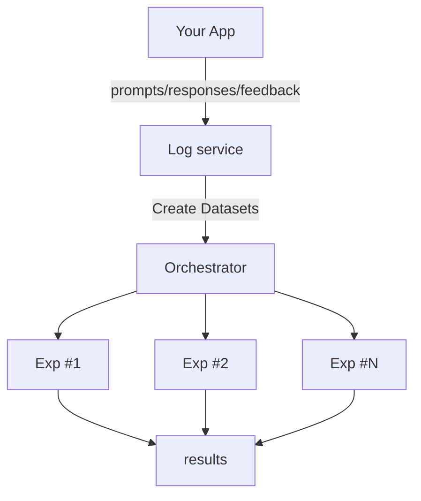
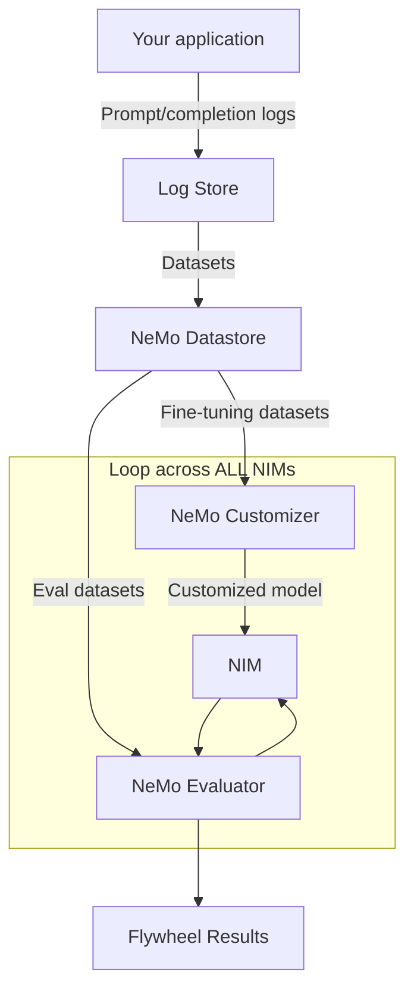

# AI Model Distillation for Financial Data Developer Example

> **Note:** This is a financial services variant of the NVIDIA Data Flywheel Foundational Blueprint, specifically configured for financial news classification workloads with F1-score evaluation. The underlying architecture and core functionality remain based on the Data Flywheel Blueprint.

Deploy this developer example to create a **production-grade autonomous Data Flywheel service** that uses the NeMo Microservices platform to continuously discover and promote more efficient models for financial data analysis.

You can get started quickly and achieve similar results using your own infrastructure by following the [Quickstart guide](./docs/02-quickstart.md).

## Quick Overview

This developer example provides a reusable recipe to experiment and train distilled models using the NVIDIA Data Flywheel Blueprint. At the heart of the blueprint is the flywheel orchestrator, a unified control plane that abstracts the complexity of interacting directly with NVIDIA NeMo microservices. The orchestrator API coordinates the data flywheel job by leveraging a suite of modular NeMo microservices:

- **NVIDIA NeMo Customizer** to handle lightweight LoRA-based fine-tuning
- **NVIDIA NeMo Evaluator** to automate evaluations across runs
- **NeMo Datastore** to manage structured datasets and artifacts
- **NeMo Deployment Manager** to spin up and serve candidate distilled models dynamically for inference

Each microservice is packaged as a Docker container for consistent deployment across different environments. This workflow is orchestrated through Kubernetes integration, ensuring dynamic orchestration of NIM microservices for experimentation and production workloads.

**Key Differentiator**: This financial services variant is optimized for classification workloads using F1-score evaluation, making it ideal for capital markets use cases such as financial news classification, sentiment analysis, and risk prediction.

---

## Capital Markets Flywheel Use Case

Large language models (LLMs) in quantitative finance are increasingly used for alpha generation, automated report analysis, and risk prediction. Yet adoption is constrained by cost, latency, and integration complexity. In financial markets, where alpha signals emerge from rapidly evolving data, the ability to continuously fine-tune, distill, and deploy models from proprietary and real-world sources is crucial.

This developer example demonstrates how NVIDIA technology enables continuous model fine-tuning and distillation, enabling integration into financial workflows. Researchers can systematically optimize, compress, and deploy high-performing models with direct connectivity to backtesting and strategy evaluation processes.

**The AI Model Distillation for Financial Data developer example is intended for quantitative researchers, AI developers, and enterprise data scientists.** Through the flywheel we operate over a financial newsfeed dataset to generate features from unstructured data that can be used for alpha research and risk prediction. The result is a set of smaller, domain-specific, and task-optimized models that maintain high accuracy while reducing computational overhead and deployment costs.

### Key Capabilities for Capital Markets

The developer example enables teams to:

- **Distill large LLMs into efficient domain-specific versions** suited for financial text, thus reducing latency and inference costs while maintaining accuracy targets.
- **Accelerate backtesting and strategy evaluation** by enabling rapid iteration and evaluation of trading signals, while maintaining model accuracy as market conditions and data sources evolve.
- **Ensure scalability and observability** by facilitating model evaluation with built-in experiment tracking.
- **Deploy distilled models alongside existing NIMs** into financial AI workflows across on-premises, hybrid cloud, and edge environments.

These capabilities enable the deployment of lightweight, specialized models directly into research pipelines, trading systems, or edge inference environments.

---

## What is a Data Flywheel?

A data flywheel is a process that uses data exhaust from production applications (for example, LLM prompt/response logs, end user feedback, and expert labeling) to increase the overall accuracy and reduce the latency/cost of Generative AI systems. A very high level flow looks like this:



Production traffic from your application is routed to a centralized logging service. From there, evaluation and fine-tuning datasets are created and used in a series of offline experiments. Anyone who has done this manually knows there are a lot of options to consider when designing the experiments, and many of them depend on the kinds of data you have:

- Which models do you pick?
- In what ways do you curate your datasets?
- Which fine-tuning techniques do you try?
- Which metrics do you use in evals?

It's a lot to decide on. Enter: The NeMo Microservice Platform.

### Where the NeMo Microservices Come In

The NeMo Microservice platform allows for programmatic control of **datasets**, **fine-tuning**, **evaluation**, and **inference**. This means that rather than having ML engineers manage each experiment, you can automate the exploration of various configurations using sensible defaults, and then present the most promising candidates to a research engineer or machine learning engineer for further analysis.



In just a few hours, this automated process built on top of NeMo microservices can:

1. Pull data from your log store.
2. Group it by task (for example, if you have an agent doing multiple things, each node is a different task).
3. De-dup it.
4. Create eval and fine-tuning datasets from your production traffic using **class-aware stratified splitting** to ensure balanced representation across tool types, and store them in NeMo Datastore.
5. Kick off fine-tuning jobs with NeMo Customizer.
6. Run evaluations with appropriate metrics (F1-score for classification, LLM-as-judge for tool calling) on NeMo Evaluator.

With reasonable defaults, the system automatically narrows a vast number of possible options down to a manageable set of promising candidates for further analysis—no manual experiment design required.

**👆 This is the key insight of the Data Flywheel Blueprint built on top of NeMo microservices**.

You can scale this process across any number of NIMs by using NeMo Deployment Manager to dynamically start and stop NIMs as needed, so you don't have to keep every NIM running at all times. This cycle can be repeated as frequently as desired: daily, weekly, or on your own schedule.

Data Flywheels are a fledgling concept in Generative AI, but already real-world tests within NVIDIA have identified instances where **using a flywheel can reduce inference costs by up to 98.6%**. There are caveats to this which we discuss below, but we believe these early data points warrant attention.

---

## Differences from the Data Flywheel Foundational Blueprint

This financial services variant is based on the NVIDIA Data Flywheel Foundational Blueprint but includes several key modifications optimized for capital markets and quantitative finance use cases. The following differences are explicitly configured and should be understood when using this variant:

### 1. Evaluation Metrics: F1-Score for Classification

**Data Flywheel Blueprint (Original):**
- Uses **LLM-as-judge similarity metrics** (range `[0, 1]`) for evaluation
- Optimized for tool-calling workloads and agent routing tasks
- Evaluates model responses using semantic similarity comparisons

**Financial Services Variant (This Example):**
- Uses **F1-score** as the primary evaluation metric for classification workloads
- Optimized for financial news classification and text categorization tasks
- Evaluates model responses by comparing classification labels against ground truth
- Default `workload_type: "classification"` in configuration

**Impact:** The evaluation results will show F1-scores instead of similarity scores. Higher F1-scores (closer to 1.0) indicate better classification accuracy. This is more appropriate for categorical labeling tasks common in financial data analysis.

### 2. Workload Type Configuration

**Data Flywheel Blueprint (Original):**
- Default `workload_type: "auto"` (auto-detects based on data)
- Primarily designed for tool-calling workloads

**Financial Services Variant (This Example):**
- Default `workload_type: "classification"` in `config/config.yaml`
- Explicitly configured for classification tasks
- Still supports tool-calling workloads when configured

**Configuration Location:** `config/config.yaml` → `evaluation_config.workload_type: "classification"`

### 3. Evaluation Dataset Size

**Data Flywheel Blueprint (Original):**
- Default `eval_size: 20` examples for evaluation set

**Financial Services Variant (This Example):**
- Default `eval_size: 100` examples for evaluation set
- Larger evaluation set provides more robust performance assessment for classification tasks

**Configuration Location:** `config/config.yaml` → `data_split_config.eval_size: 100`

### 4. Namespace Configuration

**Data Flywheel Blueprint (Original):**
- Default namespace: `"dwfbp"` (Data Flywheel Blueprint)

**Financial Services Variant (This Example):**
- Default namespace: `"dfwfd"` (Data Flywheel for Financial Data)
- All NeMo Microservices Platform resources are namespaced to `"dfwfd"`

**Configuration Location:** `config/config.yaml` → `nmp_config.nmp_namespace: "dfwfd"`

### 5. Use Case and Dataset Focus

**Data Flywheel Blueprint (Original):**
- General-purpose agent workloads
- Tool-calling and routing use cases
- Example: HR chatbot with multiple agent nodes

**Financial Services Variant (This Example):**
- **Financial news classification** workloads
- Capital markets and quantitative finance focus
- Example: Classifying financial news headlines into categories (e.g., "Analyst Rating", "Stock price movement", "Regulatory")
- Designed for alpha research and risk prediction workflows

### 6. Model Evaluation Approach

**Data Flywheel Blueprint (Original):**
- Compares student model responses using LLM-as-judge similarity
- Focuses on semantic similarity and response quality

**Financial Services Variant (This Example):**
- Compares student model classification labels using F1-score
- Focuses on categorical accuracy and label matching
- Uses teacher model responses as ground truth for classification labels

### 7. Score Interpretation

**Data Flywheel Blueprint (Original):**
- Scores are LLM-as-judge similarity metrics in range `[0, 1]`
- Higher scores indicate better semantic similarity to teacher model

**Financial Services Variant (This Example):**
- Scores are F1-scores in range `[0, 1]`
- Higher scores indicate better classification accuracy
- F1-score balances precision and recall for categorical predictions

### Summary of Configuration Differences

| Aspect | Data Flywheel Blueprint | Financial Services Variant |
|--------|------------------------|---------------------------|
| **Default Workload Type** | `"auto"` | `"classification"` |
| **Evaluation Metric** | LLM-as-judge similarity | F1-score |
| **Default Eval Size** | 20 | 100 |
| **Default Namespace** | `"dwfbp"` | `"dfwfd"` |
| **Primary Use Case** | Tool-calling, agent routing | Financial news classification |
| **Score Interpretation** | Semantic similarity | Classification accuracy |

**Note:** All differences are configurable. You can switch back to tool-calling evaluation by setting `workload_type: "tool_calling"` in the configuration file, or use auto-detection with `workload_type: "auto"`.

---

## How to Use This Blueprint

The strategies in this reference implementation have proven effective in some use cases, but our work is ongoing. Some aspects of this implementation may go against common wisdom:

- Routing production traffic directly into fine-tuning without PII removal
- Building evaluation datasets with no ground truth other than what the production model is responding with
- Not doing any hand-labeling of data

Nonetheless, we've shown it can work. And more importantly, we believe this idea of collecting production traffic prompt/response logs, running automated experiments to explore a huge solution space, and then flagging interesting candidates for further analysis will become an indispensable part of the future Generative AI stack.

Therefore, to effectively use this blueprint:

1. **Learn from the reference implementation**
   - **Play with the Launchable**: Walk through setting up NeMo microservices, deploying the reference services, and exercising the flywheel with the provided sample dataset.
   - **Read the code & docs**: Finish this README and skim the source to understand how the API layer, background tasks, and NeMo microservices integrations fit together.

2. **Prepare your traffic**
   - **Instrument production applications**: Every distinct LLM call (agent node, route, tool, etc.) must emit a stable `workload_id`. Optionally include a free-form description string—ignored by inference but useful for future workload classification.
   - **Export or connect your logs**: If you're already logging prompt/response pairs, write a small connector (or use an existing one) to push them into Elasticsearch or directly into the Flywheel API.

3. **Choose how to run the Flywheel**
   - **Always-on service**: Keep the stack running in a shared k8s/VM environment so new traffic is evaluated continuously.
   - **Ad-hoc run**: Spin it up locally on a workstation with a few GPUs, load a slice of traffic, kick off a job, and shut everything down when the results are in.

4. **Kick off a run**
   - Load or stream the tagged traffic into Elasticsearch to launch a job. The system will spin up the necessary NIMs, schedule evaluations and fine-tunes, and track everything automatically.

5. **Interpret the results**
   - The response is grouped by NIM. For each NIM the Flywheel currently runs two experiment types:
     • **base-eval** – Zero-shot F1-score baseline of student model before customization
     • **customized-eval** – F1-score evaluation of customized model after fine-tuning
   - **For classification workloads** (default): Scores are F1-scores in the range `[0, 1]`. Look for high-scoring small models (F1-score closer to 1.0), then download the datasets, LoRA adapters, or model artifacts for manual inspection and further analysis.
   - **For tool-calling workloads**: Scores include function name accuracy, function name and arguments accuracy, and optionally LLM-as-judge correctness.

6. **Keep the human in the loop**
   - Think of the Flywheel as a flashlight, not an autopilot. Promotion to production—as well as any deeper evaluation or dataset curation—remains a human decision.

7. **Stay up to date**
   - Follow the repo for UI improvements, new experiment strategies, and future work on accuracy-oriented flywheels.

### Preparing your data

The Flywheel treats your production **prompt / completion logs** as the single source of truth. At run-time it only needs to know *where* to find the logs (e.g. an Elasticsearch index) and *how* the individual documents are shaped. Since this is a reference implementation, you can modify the code to suit your needs, but the current schemas are defined below should you decide to conform to them.

#### 1 – Log schema

Each Elasticsearch document **must** contain the following top-level keys:

| Field        | Type               | Description                                                         |
|--------------|--------------------|---------------------------------------------------------------------|
| `timestamp`  | `int` (epoch secs) | Time the request was issued                                         |
| `workload_id`| `str`              | Stable identifier for the logical task / route / agent node         |
| `client_id`  | `str`              | Identifier of the application or deployment that generated traffic  |
| `request`    | `dict`             | Exact [`openai.ChatCompletion.create`](https://platform.openai.com/docs/api-reference/chat/create) payload received by the model |
| `response`   | `dict`             | Exact `ChatCompletion` response returned by the model               |

**For classification workloads** (financial services variant default), the response content should contain classification labels wrapped in double square brackets:

```jsonc
{
  "timestamp": 1715854074,
  "workload_id": "news_classifier",
  "client_id": "financial-news-dataset",
  "request": {
    "model": "meta/llama-3.3-70b-instruct",
    "messages": [
      {
        "role": "system",
        "content": "You are a financial news classifier."
      },
      {
        "role": "user",
        "content": "Mid-Afternoon Market Update: Dow Up Over 200 Points; Lakeland Industries Shares Spike Higher"
      }
    ]
  },
  "response": {
    "choices": [
      {
        "message": {
          "role": "assistant",
          "content": "[[[Stock price movement]]]"
        }
      }
    ]
  }
}
```

*Why this shape?* Keeping the full request/response allows the Flywheel to replay prompts, build few-shot demonstrations, and fine-tune without lossy conversions. For classification workloads, labels wrapped in `[[[...]]]` in the response content are extracted by NeMo Evaluator as ground truth for F1-score evaluation.

> **Tagging matters** • `client_id` is meant to identify *who* produced the traffic (for example a specific micro-service, environment, or customer). Multiple workloads can share the same `client_id`.
> **`workload_id` is much stricter:** it represents a single *type* of request. If your application is an agent with several nodes you **must assign a different `workload_id` to every node** so the Flywheel can evaluate them independently. Treat it as the primary key for slicing, deduplication, and dataset creation.

#### 2 – Instrumenting an application

If you already write request/response logs, you can either route that traffic to a production Elasticsearch instance that you manage or bulk import them into the Elasticsearch instance started by `docker-compose`. For new projects the snippet below shows how a **synchronous** OpenAI call can be wrapped so every interaction is written in the expected format.

> 💡 For a more comprehensive example of instrumenting an application using LangChain with an AI Virtual Assistant (AIVA), see our [Data Logging Guide](./docs/data-logging.md).

```python
# examples/log_to_es.py
import os, time, uuid
from elasticsearch import Elasticsearch
from openai import OpenAI

ES_URL = os.getenv("ELASTICSEARCH_URL", "http://localhost:9200")
ES_INDEX = os.getenv("ES_COLLECTION_NAME", "flywheel")

es = Elasticsearch(hosts=[ES_URL])
openai_client = OpenAI()

CLIENT_ID = "financial_news_app"

# Example workload for financial news classification
WORKLOAD_ID = "news_classifier"

def log_classification(workload_id: str, messages: list[dict]):
    # 1) call the LLM
    response = openai_client.chat.completions.create(
        model="meta/llama-3.3-70b-instruct",
        messages=messages,
        temperature=0.3,
    )

    # 2) build the document
    doc = {
        "timestamp": int(time.time()),
        "workload_id": workload_id,
        "client_id": CLIENT_ID,
        "request": {
            "model": response.model,
            "messages": messages,
            "temperature": 0.3,
            "max_tokens": 1024,
        },
        "response": response.model_dump(),  # OpenAI python-sdk v1 returns a pydantic model
    }

    # 3) write to Elasticsearch
    es.index(index=ES_INDEX, document=doc, id=str(uuid.uuid4()))

# --- Example usage -----------------------------------------------------------
messages = [
    {"role": "system", "content": "You are a financial news classifier."},
    {"role": "user", "content": "Analyst: Chipotle Is Successful Because It Sticks To What Works"}
]
log_classification(WORKLOAD_ID, messages)
```

💡 **Streaming responses**: the OpenAI SDK delivers tokens incrementally in streaming mode. If you are using streaming mode in your clients, you will need to take that into account and either buffer the stream and reconstruct a full `response` object before indexing, or modify the Flywheel importer to reconstruct the full response.

#### 3 – Import helpers and customization

The reference implementation already bundles helpers you can reuse:

* `src/scripts/load_test_data.py` – CLI to bulk-load a JSONL file into the Flywheel index.
* `src/tasks/tasks.py::create_datasets` – Celery task that *reads* logs, deduplicates them, and turns them into evaluation & training datasets.

Feel free to swap Elasticsearch for another store or adjust the mapping – just make sure `create_datasets` can still retrieve documents in the schema above.

### Real-World Results and What to Expect

The Data Flywheel Foundational Blueprint is a reference implementation of _some_ of the techniques we have explored within NVIDIA. While far from a silver bullet, real-world tests within NVIDIA have found instances where **using a Data Flywheel can reduce inference costs by up to 98.6%**, while maintaining comparable accuracy. These use cases tend to center around simpler tool calling use cases where an agent is using a tool call to route between a small set of tools. In the 98.6% example, we took traffic from an internal HR chatbot. This chat used an LLM -- `llama-3.1-70b-instruct` -- for several purposes:

1. Chat
2. Query rewriting for RAG
3. Summarization
4. Tool calling

The Flywheel identified that the Tool Calling use case ended up being simple enough that a fine-tuned `llama-3.2-1b-instruct` was able to achieve ~98% accuracy relative to the 70b model being used in production.

We have also found instances where `Qwen-2.5-32b-coder` did as well as `Llama-3.1-70b-instruct` without any fine-tuning, and so were able to quickly reduce inference costs and time to first token by >50% by swapping out a NIM.

**For financial services classification workloads**, the flywheel enables similar cost reduction opportunities by distilling large teacher models (e.g., 49B or 70B parameters) into smaller student models (1B, 3B, or 8B) that maintain high F1-scores on domain-specific classification tasks. Results from the financial news classification example show that with sufficient training data (25,000 examples), student models can achieve F1-scores of 0.90-0.95 relative to the teacher model, enabling significant cost savings while maintaining classification accuracy.

### Additional Reading

**Data Flywheel Blueprint Documentation:**
* [Complete Documentation Guide](./docs/README.md) - Role-based navigation and comprehensive documentation index

**External Resources:**
* [Scale Financial Data Workflows With AI Model Distillation Using the NVIDIA Data Flywheel Blueprint](https://developer.nvidia.com/blog/) - Technical blog post covering this financial services variant
* [Enhance Your AI Agent with Data Flywheels Using NVIDIA NeMo Microservices](https://developer.nvidia.com/blog/enhance-your-ai-agent-with-data-flywheels-using-nvidia-nemo-microservices/) - General Data Flywheel Blueprint overview
* [Overview of NeMo Microservices](https://docs.nvidia.com/nemo/microservices/latest/about/index.html) - NeMo Microservices Platform documentation
* [Enterprises Onboard AI Teammates Faster With NVIDIA NeMo Tools to Scale Employee Productivity](https://blogs.nvidia.com/blog/nemo-enterprises-ai-teammates-employee-productivity/) - Enterprise use cases

## Technical Details

### Key Features

- Data Collection and Storage:
  - Elasticsearch for logging prompt/completion data
  - MongoDB for API and metadata storage
  - Redis for task queue management
- Model Integration:
  - Support for Meta Llama 3.2 1B Instruct model (configurable for 3B, 8B variants)
  - Configurable context length (default: 8192 tokens, maximum: 32768 tokens)
- Training and Evaluation:
  - In-context learning (ICL) with configurable parameters
  - LoRA-based fine-tuning support
  - **Automated stratified data splitting** using scikit-learn for balanced datasets
  - **F1-score evaluation** for classification workloads (default)
- Deployment Infrastructure:
  - Docker Compose setup for development
  - Celery workers for background processing
  - Health monitoring for core services
- Resource Management:
  - Automatic cleanup of running resources during system shutdown
  - Manual cleanup scripts for maintenance operations
  - Comprehensive error handling and logging

### Design Philosophy

The Data Flywheel Foundational Blueprint empowers organizations to accelerate the optimization of AI models for cost and performance. Rather than offering a one-size-fits-all solution, this blueprint provides a practical framework and proven tools to guide your journey toward more efficient, production-ready models.

1. **Reference Implementation for Real-World Impact**
   This blueprint demonstrates the capabilities of NeMo Microservices, providing a foundation you can adapt and extend to meet your specific production requirements.

2. **Streamlined Human Oversight**
   The Flywheel process is designed to minimize manual intervention. Human review is reserved for evaluating candidate models after automated assessments, eliminating the need for ongoing user feedback or manual labeling.

3. **Cost and Latency Optimization**
   The primary focus is on reducing inference costs and latency by distilling larger models into smaller, high-quality alternatives. Future updates will further enhance accuracy and introduce advanced prompt and agent optimization features.

4. **Iterative, Data-Driven Improvement**
   Each iteration provides valuable insights, even when a smaller model is not immediately identified. This iterative approach ensures continuous learning and improvement.

5. **Seamless Integration with Existing Workflows**
   - Designed for teams with existing generative AI applications in production.
   - Easily integrates with your current logging and workload tagging practices.
   - Supports enhanced workload descriptions for improved future classification.
   - Leverages robust infrastructure—including Elasticsearch, MongoDB, Redis, and NeMo microservices—to store data, build datasets, run evaluations, fine-tune models, and re-evaluate results.

To get the most value from the Data Flywheel Foundational Blueprint, ensure you have:

- An existing generative AI application in production.
- Logging of prompt/completion traffic, with workload tagging (such as routes, nodes, or agent steps).
- (Optional, but recommended) Descriptive metadata for each workload to support future classification.
- The ability to deploy and operate supporting infrastructure (Elasticsearch, MongoDB, Redis, and NeMo microservices) for data storage, dataset creation, evaluation, and fine-tuning.

By following this blueprint, you can confidently advance your AI model optimization initiatives, leveraging a process that is transparent, adaptable, and focused on measurable outcomes.

#### Future Roadmap
The blueprint purposely keeps the first release simple. Areas we are actively exploring for future versions include:

| Theme | Example Ideas |
|-------|--------------|
| **Automated Data Collection** | Integrated collection of model inputs/outputs, latency, and metadata |
| **Visualization Dashboards** | Pre-built Grafana/Kibana dashboards for cost, latency, drift and accuracy trends |
| **Agentic Observability & Prompt Insights** | Detect regression, drift, or improvement trends based on performance telemetry |
| **Dynamic Configuration Overrides** | Runtime overrides for config.yaml settings via API or environment variables |
| **Data Governance & Privacy** | PII redaction pipeline support for logs and datasets; fine-grained RBAC on dataset access and usage |
| **Data Governance & Privacy** | Enable experiment tracking tooling for granular tracking of fine-tune runs, metrics, artifacts, and config diffs |
| **Hyper-parameter Sweeps** | Support launching NeMo microservices hyper-parameter sweeps from external tools (e.g. Flywheel) and pulling results back for analysis and visualization |
| **Smarter Dataset Construction** | Heuristics or LLM-based parsing to derive eval vs. fine-tune splits from logs; support for DPO/KTO pipelines or filtering by thumbs-up/down signal |
| **Model & Backend Extensibility** | Add support for additional NIMs such as Qwen, LLaMA-Nemotron, and Mistral; include testing and evaluation support for quantized models |

### Software Components

The blueprint consists of the following implemented components:

- **API Layer**:
  - FastAPI-based REST endpoints (`src/api/endpoints.py`)
  - Data models and schemas (`src/api/models.py`, `src/api/schemas.py`)
  - Job service for task management (`src/api/job_service.py`)
- **Data Storage**:
  - Elasticsearch for log storage
  - MongoDB for API data persistence (`src/api/db.py`)
  - Redis for task queue
- **Task Processing**:
  - Celery workers for background jobs (`src/tasks/tasks.py`)
  - Configurable concurrency and monitoring
- **NeMo Microservices Integration**:
  - Datastore client for dataset management
  - Model evaluation and customization interfaces
  - Configurable NeMo microservices endpoints

### Technical Diagrams

For details on the architecture of a Flywheel and the components of this Blueprint, view the [Architecture Overview](./docs/01-architecture.md).

### Minimum System Requirements

| Requirement Type | Details |
|-------------------------|---------|
| Minimum GPU | **Classification workloads** (default): 2× (NVIDIA H100, A100, H200, or B200 GPUs)<br>**Tool-calling workloads with LLM-as-judge**: 6× (NVIDIA H100 or A100 GPUs) |
| Cluster | Single-node NVIDIA GPU cluster on Linux with cluster-admin permissions |
| Disk Space | At least 200 GB free (500 GB required for Minikube deployments) |
| Software | Python 3.10+<br>Docker Engine<br>Docker Compose v2 |
| Services | Elasticsearch 8.12.2<br>MongoDB 7.0<br>Redis 7.2<br>FastAPI (API server)<br>Celery (task processing) |
| Resource | **Minimum Memory**: 1GB (512MB reserved for Elasticsearch)<br>**Storage**: Varies by log volume/model size<br>**Network**: Ports 8000 (API), 9200 (Elasticsearch), 27017 (MongoDB), 6379 (Redis) |
| Development | Docker Compose for local dev with hot reloading<br>Supports macOS (Darwin) and Linux<br>Optional: GPU support for model inference |
| Production | Kubernetes cluster (recommended)<br>Resources scale with workload<br>Persistent volume support for data storage |

### Task Serialization Safeguard 🌐

**Why only one Flywheel run at a time?** When the Flywheel kicks off a run it may need to spin up **multiple NIMs and customization jobs, each of which can claim one or more GPUs**. The reference implementation does not yet discover the number of free GPUs in the cluster, so it uses a simple guardrail: **all invocations of `run_nim_workflow_dag` are serialized**.

* The task is bound to a dedicated Celery queue (`parent_queue`). In the `docker-compose.yaml` there is a worker dedicated to this queue whose concurrency is set to `1`. There is a second worker bound to the default `celery` queue which can handle running other tasks (e.g. evals) in parallel.
* Inside the task we wait for the full DAG to complete via `async_result.get(...)` before returning.
* The call to create a job (i.e. `POST /jobs`) will not block, however. It will return immediately with a Job ID

This ensures that only **one** Flywheel experiment can allocate GPUs at any given time, preventing accidental overallocation that would lead to failed NIM deployments or customizations.

**Roadmap** – Automatic GPU introspection and smarter scheduling are planned for a future version of the Blueprint so multiple Flywheel runs can execute in parallel when resources permit.

## Next Steps

- Review the [Architecture Overview](./docs/01-architecture.md)
- Follow the [Quickstart Guide](./docs/02-quickstart.md) to deploy this blueprint
- Read the [Configuration Guide](./docs/03-configuration.md) for detailed setup options
- Understand your role with the [Audience Guide](./docs/04-audience-guide.md)
- Review [Limitations & Best Practices](./docs/05-limitations-best-practices.md) before promoting any model
- Learn about [Evaluation Types and Metrics](./docs/06-evaluation-types-and-metrics.md)
- Integrate with the [API Reference](./docs/07-api-reference.md) for programmatic access
- Understand [Workflow Orchestration](./docs/08-workflow-orchestration.md) for debugging and customization
- Explore [NeMo Platform Integration](./docs/09-nemo-platform-integration.md) for advanced features
- Deploy in production using the [Production Deployment Guide](./docs/10-production-deployment.md)
- Set up Kubernetes with [Helm Installation](./docs/11-helm-installation.md)
- Extract models using [LoRA Model Extraction](./docs/12-lora-model-extraction.md)

## Available Customizations

The following are some of the customizations that you can make after you complete the steps in the [Quickstart Guide](./docs/02-quickstart.md).

| Category | Description | Available Options |
|----------|-------------|------------------|
| [Environment Variables](docs/03-configuration.md#environment-variables) | Configure system using environment variables | • **Required Variables**: NGC_API_KEY, NVIDIA_API_KEY<br>• **Optional Variables**: ES_COLLECTION_NAME, ELASTICSEARCH_URL, MONGODB_URL, REDIS_URL<br>• **Configuration**: Via .env file or system environment |
| [Model Integration](docs/03-configuration.md#model-integration) | Configure and deploy LLM models | • **Currently Supported**: Meta Llama 3.2 1B Instruct (3B, 8B configurable)<br>• **Context Length**: Default 8192 tokens, configurable up to 32768 tokens<br>• **Hardware Config**: GPU support (configurable), PVC size (configurable)<br>• **Version Control**: Model tags supported |
| [Evaluation Settings](docs/03-configuration.md#evaluation-settings) | Configure data splitting and evaluation parameters | • **Data Split**: Eval size (default: 100 for financial services variant), validation ratio (0.1)<br>• **Minimum Records**: 50 records required<br>• **Reproducibility**: Optional random seed<br>• **Workload Type**: Classification (default), tool_calling, or auto-detect<br>• **ICL Settings**: Context length (default 8192, max 32768), reserved tokens (default 2048), examples (min 1, max 3)<br>• **Example Selection**: Uniform tool distribution or embedding similarity<br>• **Embedding Support**: Local/remote embedding NIMs for similarity-based selection |
| [Fine-tuning Options](docs/03-configuration.md#fine-tuning-options) | Customize model training | • **Training Type**: SFT (Supervised Fine-Tuning)<br>• **Method**: LoRA with configurable parameters<br>• **Parameters**: epochs (1), batch size (64), learning rate (0.0001)<br>• **LoRA Config**: adapter dimension (16), dropout (0.1) |
| [Data Infrastructure](docs/03-configuration.md#data-infrastructure) | Configure data storage and processing | • **Storage**: Elasticsearch for logs<br>• **Queue**: Redis for task processing<br>• **Database**: MongoDB for API data<br>• **Processing**: Celery workers with configurable concurrency |
| [Deployment Options](docs/03-configuration.md#deployment-options) | Infrastructure configuration | • **Development**: Docker Compose with hot reloading<br>• **Production**: Kubernetes deployment via [Helm charts](docs/11-helm-installation.md)<br>• **Services**: API, Celery Worker, Redis, MongoDB, Elasticsearch<br>• **Resource Config**: Network mode, volume mounts, health checks<br>• **Environment**: Configurable URLs and API keys |

Refer to the [Configuration Guide](./docs/03-configuration.md) for more information.

## Contributing

1. Install development dependencies:

   ```sh
   uv sync --dev
   ```

   This command installs all dependencies needed to build the container and run the tests.

2. Start required services:

   ```sh
   ./scripts/run.sh
   ```

   This starts the necessary services via docker compose that are required for testing.

3. Run the tests:

   - For unit tests (requires MongoDB from docker compose):

     ```sh
     uv run pytest
     ```

   - For integration tests (with mocked NeMo microservices components):

     ```sh
     uv run pytest -m integration
     ```

4. Clean up after development:

   - Stop all services:

     ```sh
     ./scripts/stop.sh
     ```

   - (Optional) Clear all database volumes:

     ```sh
     ./scripts/clear_all_volumes.sh
     ```

If you modify the API, regenerate the openapi.json with the following command:

```sh
uv run python scripts/generate_openapi.py
```

## License

This NVIDIA AI BLUEPRINT is licensed under the [Apache License, Version 2.0.](./LICENSE) This project will download and install additional third-party open source software projects and containers. Review [the license terms of these open source software projects](./LICENSE-3rd-party.txt) before use.

The software and materials are governed by the NVIDIA Software License Agreement (found at https://www.nvidia.com/en-us/agreements/enterprise-software/nvidia-software-license-agreement/) and the Product-Specific Terms for NVIDIA AI Products (found at https://www.nvidia.com/en-us/agreements/enterprise-software/product-specific-terms-for-ai-products/), except that models are governed by the AI Foundation Models Community License Agreement (found at NVIDIA Agreements | Enterprise Software | NVIDIA Community Model License) and NVIDIA dataset is governed by the NVIDIA Asset License Agreement found [here](./LICENSE-dataset).

For Meta/llama-3.1-70b-instruct model the Llama 3.1 Community License Agreement, for nvidia/llama-3.2-nv-embedqa-1b-v2model the Llama 3.2 Community License Agreement, and for the nvidia/llama-3.2-nv-rerankqa-1b-v2 model the Llama 3.2 Community License Agreement. Built with Llama.

## Disclaimer:

The Data Flywheel Blueprint is shared as reference and is provided "as is". The security in the production environment is the responsibility of the end users deploying it. When deploying in a production environment, please have security experts review any potential risks and threats; define the trust boundaries, implement logging and monitoring capabilities, secure the communication channels, integrate AuthN & AuthZ with appropriate controls.
