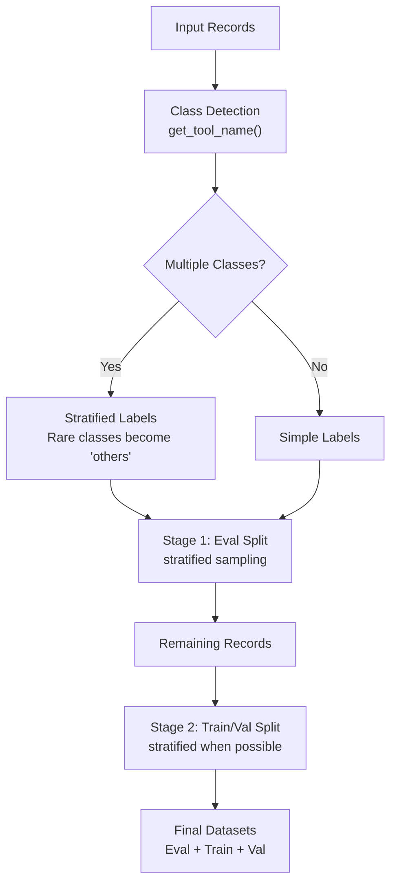

# Configuration Guide

Learn how to configure the AI Model Distillation for Financial Data Developer Example using this guide. It covers all available configuration options, their impacts, and recommended settings.

- [Configuration Guide](#configuration-guide)
  - [Prerequisites](#prerequisites)
    - [System Requirements](#system-requirements)
    - [Required API Keys and Access](#required-api-keys-and-access)
      - [NGC API Key](#ngc-api-key)
      - [NVIDIA API Key (for Remote Configurations)](#nvidia-api-key-for-remote-configurations)
      - [Hugging Face Token](#hugging-face-token)
    - [Git LFS Setup](#git-lfs-setup)
  - [Before You Start](#before-you-start)
  - [Configuration File Location](#configuration-file-location)
  - [Environment Variables](#environment-variables)
    - [Required Environment Variables](#required-environment-variables)
    - [Optional Environment Variables](#optional-environment-variables)
    - [Environment Setup Examples](#environment-setup-examples)
  - [NeMo microservices Configuration](#nemo-microservices-configuration)
  - [Logging Configuration](#logging-configuration)
  - [MLflow Configuration](#mlflow-configuration)
    - [Enabling MLflow](#enabling-mlflow)
  - [Model Integration](#model-integration)
    - [Supported Models](#supported-models)
  - [Evaluation Settings](#evaluation-settings)
    - [Workload Type Configuration](#workload-type-configuration)
    - [Data Split Configuration](#data-split-configuration)
      - [Stratified Splitting Behavior](#stratified-splitting-behavior)
      - [Graceful Degradation](#graceful-degradation)
      - [Splitting Process Visualization](#splitting-process-visualization)
      - [Examples](#examples)
      - [Configuration Recommendations by Use Case](#configuration-recommendations-by-use-case)
  - [Fine-tuning Options](#fine-tuning-options)
    - [Training Configuration](#training-configuration)
    - [LoRA Configuration](#lora-configuration)
  - [Model Customization](#model-customization)
    - [Overview](#overview)
    - [Configuration Structure](#configuration-structure)
    - [Target Models](#target-models)
    - [Customization Parameters](#customization-parameters)
    - [Training Integration](#training-integration)
    - [Example Configurations](#example-configurations)
    - [Best Practices](#best-practices)
  - [Data Infrastructure](#data-infrastructure)
    - [Storage Services](#storage-services)
    - [Processing Configuration](#processing-configuration)
  - [Deployment Options](#deployment-options)
    - [Development Environment](#development-environment)
    - [Production Deployment Options](#production-deployment-options)
      - [Docker Compose (Simple Production)](#docker-compose-simple-production)
      - [Kubernetes with Helm (Enterprise Production)](#kubernetes-with-helm-enterprise-production)
    - [Resource Configuration](#resource-configuration)

## Prerequisites

### System Requirements

| Requirement Type | Details |
|-------------------------|---------|
| **Minimum GPU** | 2× (NVIDIA A100/H100/H200/B200 GPUs) |
| **Cluster** | Single-node NVIDIA GPU cluster on Linux with cluster-admin permissions |
| **Disk Space** | At least 200 GB free (500 GB required for Minikube deployments) |
| **Software** | Python 3.10+<br>Docker Engine<br>Docker Compose v2 |
| **Services** | Elasticsearch 8.12.2<br>MongoDB 7.0<br>Redis 7.2<br>FastAPI (API server)<br>Celery (task processing)<br>MLflow 2.22.0<br>Wandb 0.22.3 |
| **Resource** | **Minimum Memory**: 1 GB (512 MB reserved for Elasticsearch)<br>**Storage**: Varies by log volume or model size<br>**Network**: Ports 8000 (API), 9200 (Elasticsearch), 27017 (MongoDB), 6379 (Redis) |
| **Development** | Docker Compose for local development with hot reloading<br>Supports macOS (Darwin) and Linux<br>Optional: GPU support for model inference |
| **Production** | Kubernetes cluster (recommended)<br>Resources scale with workload<br>Persistent volume support for data storage |

### Required API Keys and Access

#### NGC API Key
You must [generate a personal API key](https://org.ngc.nvidia.com/setup/api-keys) with the `NGC catalog` and `Public API Endpoints` services selected. This enables:

- Complete deployment of NMP (NeMo Microservices Platform)
- Access NIM services
- Access models hosted in the NVIDIA API Catalog
- Download models on-premises

For detailed steps, see the official [NGC Private Registry User Guide](https://docs.nvidia.com/ngc/gpu-cloud/ngc-private-registry-user-guide/index.html#generating-personal-api-key).

#### NVIDIA API Key (for Remote Configurations)
Generate an API key at [build.nvidia.com](https://build.nvidia.com) for accessing:
- Remote model inference using NVIDIA Inference Microservice (NIM)

#### Hugging Face Token
Create a token at [Hugging Face Settings](https://huggingface.co/settings/tokens) with read access for model downloads and data uploading functionality.

### Git LFS Setup
You must have Git Large File Storage (LFS) installed and configured to download the dataset files.

1. Download and install Git LFS by following the [installation instructions](https://git-lfs.com/).
2. Initialize Git LFS in your environment:
   ```bash
   git lfs install
   ```
3. Pull the dataset into the current repository:
   ```bash
   git lfs pull
   ```

## Before You Start

- Run the [Quickstart](./02-quickstart.md) to tour the functionality and default settings of the developer example.
- Run the [Notebooks](../notebooks/README.md) to understand how the developer example supports different use cases.

> **Important**
>
> Advanced configuration such as Large-scale hyper-parameter sweeps, architecture search, or custom evaluation metrics must run directly in **NeMo microservices**. The configurations in this guide are only for the developer example itself.

> **Note**
> 
> For detailed NeMo microservices API documentation, refer to the [official documentation](https://docs.nvidia.com/nemo/microservices/latest/api/index.html).

## Configuration File Location

The developer example uses a YAML-based configuration system. The primary configuration file is located at:

```bash
config/config.yaml
```

## Environment Variables

The developer example relies on several environment variables for configuration. These can be set in a `.env` file in the project root or as system environment variables.

### Required Environment Variables

| Variable | Description | Usage | Example |
|----------|-------------|-------|---------|
| `NGC_API_KEY` | API key for NVIDIA Cloud Foundation | NGC login and container downloads only | `nvapi-...` |
| `NVIDIA_API_KEY` | API key for NVIDIA API Catalog | Remote NIM access, remote model inference | `nvapi-...` |
| `HF_TOKEN` | Hugging Face authentication token | Data uploading functionality, model access | `hf_...` |

### Optional Environment Variables

| Variable | Description | Default | Usage |
|----------|-------------|---------|-------|
| `ES_COLLECTION_NAME` | Elasticsearch collection name | "flywheel" | Data storage and retrieval |
| `ELASTICSEARCH_URL` | Elasticsearch connection URL | "http://localhost:9200" | Database connection |
| `MONGODB_URL` | MongoDB connection URL | "mongodb://localhost:27017" | Database connection |
| `MONGODB_DB` | MongoDB database name | "flywheel" | Database selection |
| `REDIS_URL` | Redis connection URL | "redis://localhost:6379/0" | Task broker and results backend |

### Environment Setup Examples

**Development Setup:**
```bash
# Required for NGC login and container downloads
export NGC_API_KEY="your-ngc-api-key"

# Required for remote configurations
export NVIDIA_API_KEY="your-nvidia-api-key"
export HF_TOKEN="your-huggingface-token"

# Optional (defaults work for development)
export ES_COLLECTION_NAME="flywheel"
export ELASTICSEARCH_URL="http://localhost:9200"
```

**Production Setup:**
```bash
# Required for NGC login and container downloads
export NGC_API_KEY="your-ngc-api-key"

# Required for remote configurations
export NVIDIA_API_KEY="your-nvidia-api-key"
export HF_TOKEN="your-huggingface-token"

# Production URLs
export ELASTICSEARCH_URL="http://elasticsearch.production:9200"
export MONGODB_URL="mongodb://mongodb.production:27017"
export REDIS_URL="redis://redis.production:6379/0"
```

**For full functionality, at minimum configure:**
```bash
export NGC_API_KEY="your-ngc-api-key"
export NVIDIA_API_KEY="your-nvidia-api-key"
export HF_TOKEN="your-huggingface-token"
```


## NeMo microservices Configuration

The `nmp_config` section controls the NeMo Microservices Platform (NMP) integration:

```yaml
nmp_config:
  nemo_base_url: "http://nemo.test"
  nim_base_url: "http://nim.test"
  datastore_base_url: "http://data-store.test"
  nmp_namespace: "dfwfd"  # Data Flywheel Financial Distillation
```

| Option | Description | Default |
|--------|-------------|---------|
| `nemo_base_url` | Base URL for NeMo services | `http://nemo.test` |
| `nim_base_url` | Base URL for NIM services | `http://nim.test` |
| `datastore_base_url` | Base URL for datastore services | `http://data-store.test` |
| `nmp_namespace` | Namespace for NMP resources | Config file default: "dfwfd" (Data Flywheel Financial Distillation). Code default: "dfwbp". **Note:** The config file value takes precedence over the code default when the configuration file is loaded. |

## Logging Configuration

The `logging_config` section controls the verbosity of log output across all services:

```yaml
logging_config:
  level: "INFO"  # Options: DEBUG, INFO, WARNING, ERROR, CRITICAL
```

| Option | Description | Default | Notes |
|--------|-------------|---------|-------|
| `level` | Log verbosity level | "INFO" | Controls detail level of application logs |

The `logging_config` section configures logging level. Available options:

- `CRITICAL`: Only critical errors
- `ERROR`: Error events 
- `WARNING`: Warning messages
- `INFO`: Informational messages (default)
- `DEBUG`: Detailed diagnostic information

## MLflow Configuration

The `mlflow_config` section controls MLflow integration for experiment tracking and model management. MLflow is controlled via the `COMPOSE_PROFILES` environment variable:

```yaml
mlflow_config:
  # enabled: automatically set based on COMPOSE_PROFILES environment variable
  tracking_uri: "http://0.0.0.0:5000"
  experiment_name_prefix: "findistil"
  artifact_location: "./mlruns"
```

| Option | Description | Default | Notes |
|--------|-------------|---------|-------|
| `enabled` | Enable MLflow integration | Automatically set | Determined by checking if "mlflow" is in `COMPOSE_PROFILES` |
| `tracking_uri` | MLflow tracking server URI | "http://0.0.0.0:5000" | URL of the MLflow tracking server |
| `experiment_name_prefix` | Prefix for experiment names | "findistil" | Used to organize experiments |
| `artifact_location` | Location for MLflow artifacts | "./mlruns" | Directory for storing model artifacts |

### Enabling MLflow

To enable MLflow, set the `COMPOSE_PROFILES` environment variable to include "mlflow":

```bash
export COMPOSE_PROFILES=mlflow
docker compose -f deploy/docker-compose.yaml up -d --build
```

Or run it directly:

```bash
COMPOSE_PROFILES=mlflow docker compose -f deploy/docker-compose.yaml up -d --build
```

> **Note:**
> - The MLflow service only starts when the "mlflow" profile is enabled via `COMPOSE_PROFILES`
> - The `enabled` field in the configuration is automatically set based on the presence of "mlflow" in `COMPOSE_PROFILES`
> - When enabled, MLflow will be available at `http://localhost:5000`

## Model Integration

The `nims` section configures which models to deploy and their settings:

**Default Behavior**: When a model is listed in the `nims` section, it will automatically run base evaluation by default.

**Customization Control**: Use the `customization_enabled` key to control whether the model can be fine-tuned. When enabled, the model will also run customization and evaluation on customized model using the settings defined in `customizer_configs`.

```yaml
nims:
  - model_name: "meta/llama-3.2-1b-instruct"
    model_type: "llm"
    context_length: 8192
    gpus: 1
    pvc_size: 25Gi
    tag: "1.8.3"
    customization_enabled: true
    customizer_configs:
      target: "meta/llama-3.2-1b-instruct@2.0"
      gpus: 1
      max_seq_length: 8192
```

| Option | Description | Required | Example |
|--------|-------------|----------|---------|
| `model_name` | Name of the model to deploy | Yes | "meta/llama-3.2-1b-instruct" |
| `model_type` | Type of NIM | No | "llm" |
| `context_length` | Maximum context length in tokens | Yes | 8192 |
| `gpus` | Number of GPUs to allocate | Yes | 1 |
| `pvc_size` | Persistent volume claim size | No | "25Gi" |
| `tag` | Model version tag | Yes | "1.8.3" |
| `customization_enabled` | Whether model can be fine-tuned | No | true |

> **📖 For detailed customization configuration options:** See [Model Customization](#model-customization)

> **Note:**
> All NIMs listed in your configuration will appear in the job response with a status of `"Pending"` as soon as a job starts, even if NIMs are executed one after another. This ensures users have a transparent view of all planned model evaluations for the job. Each NIM's status will update (e.g., to `Running`, `Completed`, or `Error`) as the job progresses.

### Supported Models

Currently supported models include:
- Meta Llama 3.1 8B Instruct
- Meta Llama 3.2 1B Instruct
- Meta Llama 3.2 3B Instruct
- Meta Llama 3.3 Nemotron Super 49b v1
- Meta Llama 3.3 70B Instruct

Note: Not all models may be enabled by default in the configuration. Enable them by uncommenting and configuring the appropriate sections in `config/config.yaml`.

## Evaluation Settings

> **Note**  
> The default `workload_type: "auto"` automatically detects the workload type by analyzing your data. If you need to force a specific evaluation type, you can set `workload_type: "classification"` for F1-score based evaluation or `workload_type: "tool_calling"` for function-based metrics.

### Workload Type Configuration

The `evaluation_config` section controls how workloads are evaluated:

```yaml
evaluation_config:
  workload_type: "auto"  # Options: "auto", "classification", "tool_calling"
  tool_eval_type: "tool-calling-metric"  # For tool_calling workloads only
```

**Workload Type Options:**

- **`"classification"`** (default): Forces classification evaluation using F1-score. Use for text classification, sentiment analysis, or any categorical labeling task.
- **`"tool_calling"`**: Forces tool-calling evaluation using function name accuracy and exact match metrics. Use for agent workflows with function calls.
- **`"auto"`**: Automatically detects workload type by analyzing your data. The system checks for `tool_calls` in response messages:
  - If `tool_calls` are present → treated as `tool_calling` workload
  - If no `tool_calls` → treated as `classification` workload

**Auto-Detection Behavior:**

When `workload_type: "auto"` is set, the system:
1. Scans response messages in your logged data for `tool_calls` fields
2. If any record contains `tool_calls` → classifies as `tool_calling`
3. If no `tool_calls` found → classifies as `classification`
4. Uses appropriate evaluation metrics based on detected type

**Recommendation:** Use explicit `"classification"` or `"tool_calling"` for predictable behavior. Use `"auto"` when you have mixed workloads or want the system to adapt automatically.

**Tool Eval Type** (for `tool_calling` workloads only):

- **`"tool-calling-metric"`** (default): Uses exact match metrics (function name accuracy, function name and arguments accuracy)
- **`"tool-calling-judge"`**: Uses LLM-as-judge for correctness rating (requires `llm_judge_config` to be configured)

The `data_split_config` section controls evaluation processes:

### Data Split Configuration

The developer example uses **class-aware stratified splitting** powered by scikit-learn to ensure balanced representation of different tool types across your evaluation, training, and validation datasets.

```yaml
data_split_config:
  eval_size: 100
  val_ratio: 0.1
  min_total_records: 50
  random_seed: null
  limit: null
  parse_function_arguments: true
```

> **Note**  
> For this financial services variant, the configuration file sets `eval_size: 100`, which differs from the code default of `20`. The config file value is used when the configuration file is loaded. If you omit `data_split_config` in API requests, the service uses values from `config/config.yaml` (including `eval_size: 100`). If you include `data_split_config` in API requests, any omitted fields use the API schema defaults (code defaults, such as `eval_size: 20`).

| Option | Description | Default | Notes |
|--------|-------------|---------|-------|
| `eval_size` | Number of examples for evaluation | 100 (config file), 20 (code default) | Minimum size of evaluation set (stratified across tool types). Config file default is 100 for this financial services variant. |
| `val_ratio` | Ratio of data used for validation | 0.1 | Must be ≥ 0 and < 1 (10% of remaining data after eval, stratified) |
| `min_total_records` | Minimum required records | 50 | Total dataset size requirement |
| `random_seed` | Seed for reproducible splits | null | Set for reproducible results |
| `limit` | Limit for evaluator | null | Use all available records when null |
| `parse_function_arguments` | Parse function arguments to JSON | true | Data validation: converts string function arguments to JSON objects |

#### Stratified Splitting Behavior

It automatically analyzes your data to identify different classes (tool types) and ensures balanced representation across splits:

**1. Class Detection**: Records are classified by their tool usage using the `get_tool_name()` function.

**2. Splitting Strategy**:
- **Frequent classes**: Tool types with multiple records are split using stratified sampling
- **Rare classes**: Tool types with only one record are distributed fairly across splits

**3. Two-Stage Process**:
   - **Stage 1**: Creates evaluation set with stratified sampling from frequent classes
   - **Stage 2**: Splits remaining data into training and validation sets (also stratified when possible)

#### Graceful Degradation

When stratification isn't possible (e.g., insufficient samples per class), the system automatically falls back to random splitting while maintaining the specified split sizes.

#### Splitting Process Visualization



#### Examples

**Tool-Calling Dataset (60 records)**:
- `get_weather`: 30 records
- `schedule_meeting`: 20 records  
- `no_tool`: 10 records

**With `eval_size: 6, val_ratio: 0.2`**:
- **Eval**: 6 records (stratified: ~3 weather, ~2 meeting, ~1 no_tool)
- **Train**: 43 records (remaining after eval/val splits)
- **Val**: 11 records (20% of remaining 54 records)

**Single-Class Dataset Fallback**:
When all records use the same tool, stratification automatically falls back to random splitting while preserving split ratios.

#### Configuration Recommendations by Use Case

| Use Case | eval_size | val_ratio | min_total_records | random_seed | Notes |
|----------|-----------|-----------|-------------------|-------------|-------|
| **Development/Testing** | 20 | 0.1 | 50 | 42 | Small, reproducible |
| **Production (Balanced)** | 100 | 0.1 | 200 | null | Standard settings |
| **Production (Imbalanced)** | 50 | 0.15 | 500 | null | Larger validation set |
| **Tool-Heavy Workloads** | 200 | 0.2 | 1000 | null | More eval examples per tool |

> **Related Documentation**
> 
> - **API Usage**: See [Data Split Configuration](07-api-reference.md#data-split-configuration) for API integration
> - **Best Practices**: See [Tuning Guidelines](05-limitations-best-practices.md#tune-data_split_config-as-you-learn-workload-characteristics)
> - **Validation Process**: See [Dataset Validation](dataset-validation.md) for data quality requirements
> - **Implementation Details**: Check `src/lib/flywheel/util.py` for source code
>
> While these values are set in the configuration file, you can override them on a per-job basis by including a `data_split_config` object in the POST request to `/api/jobs`. This gives you the flexibility to use different split configurations for different jobs without modifying the configuration file.
>
> For example, you might want to:
> - Use a larger evaluation set for certain workloads
> - Adjust the validation ratio based on dataset size
> - Set a specific random seed for reproducible results
>
> You can override just the parameters you want to change - any parameters not specified in the POST request will automatically use their default values from the API schema, while omitting the entire `data_split_config` in the request uses the values defined in `config/config.yaml`. For example, you could override just the `eval_size` while keeping other parameters from the YAML.
>
> See the [Job Operations section](02-quickstart.md#job-operations) in the Quickstart Guide for a complete example.

## Fine-tuning Options

The `training_config` and `lora_config` sections control model fine-tuning:

```yaml
training_config:
  training_type: "sft"
  finetuning_type: "lora"
  epochs: 1
  batch_size: 64
  learning_rate: 0.0001

lora_config:
  adapter_dim: 16
  adapter_dropout: 0.1
  sequence_packing_enabled: true
```

### Training Configuration

| Option | Description | Default | Notes |
|--------|-------------|---------|-------|
| `training_type` | Type of training | "sft" | Supervised Fine-Tuning |
| `finetuning_type` | Fine-tuning method | "lora" | Low-Rank Adaptation |
| `epochs` | Training epochs | 1 | Full passes through data |
| `batch_size` | Batch size | 64 | Samples per training step |
| `learning_rate` | Learning rate | 0.0001 | Training step size |

### LoRA Configuration

| Option | Description | Default | Notes |
|--------|-------------|---------|-------|
| `adapter_dim` | LoRA adapter dimension | 16 | Rank of adaptation |
| `adapter_dropout` | Dropout rate | 0.1 | Regularization parameter |
| `sequence_packing_enabled` | Enable sequence packing | true | Efficient training |

## Model Customization

The developer example supports model customization (fine-tuning) through the NeMo Customizer service. This feature enables Parameter-Efficient Fine-Tuning (PEFT) using LoRA (Low-Rank Adaptation) to efficiently customize base models on your specific datasets.

### Overview

Model customization works by:
1. **Target Selection**: Choosing a base model that supports customization
2. **Configuration Setup**: Creating a customization configuration with training parameters
3. **Training Execution**: Running the fine-tuning job with your dataset
4. **Model Deployment**: Using the customized model for inference

### Configuration Structure

To enable customization for a model, add the `customization_enabled` and `customizer_configs` fields to your NIM configuration:

```yaml
nims:
  - model_name: "meta/llama-3.2-1b-instruct"
    context_length: 8192
    gpus: 1
    pvc_size: 25Gi
    tag: "1.8.3"
    customization_enabled: true  # Enable customization
    customizer_configs:
      target: "meta/llama-3.2-1b-instruct@2.0"  # Target model for customization
      gpus: 1
      max_seq_length: 8192
      # Additional training options...
```

### Target Models

**Targets** represent models that can be customized using the Customizer service. These are typically created during the initial setup of your Customizer microservice or NMP cluster.

**To find available targets:**
- Check the targets API in your NMP cluster or follow the NMP documentation to create one
- Contact your NMP administrator for the list of available targets

### Customization Parameters

The `customizer_configs` section supports the following parameters:

| Parameter | Description | Default |
|-----------|-------------|---------|
| `target` | Target model for customization | - |
| `gpus` | Number of GPUs for training | - |
| `max_seq_length` | Maximum sequence length | 4096 |
| `num_nodes` | Number of nodes for training | 1 |
| `tensor_parallel_size` | Tensor parallel size | 1 |
| `data_parallel_size` | Data parallel size | 1 |
| `use_sequence_parallel` | Enable sequence parallel | false |
| `micro_batch_size` | Micro batch size | 1 |
| `training_precision` | Training precision | "bf16-mixed" |

**Training Hyperparameters** (configured in global `training_config` and `lora_config`):

| Hyperparameter | Description | Recommended Value |
|----------------|-------------|-------------------|
| `batch_size` | Number of samples processed together before updating model parameters | 16 (recommended; use 32 only if you have validated stability and sufficient memory) |
| `learning_rate` | Step size for updating model parameters | 1e-3 to 1e-5 |
| `epochs` | Number of complete passes through the training dataset | Varies by dataset size (automatic early stopping after 10 epochs without improvement) |
| `adapter_dim` | Rank of the low-rank matrices (LoRA) | Start with 8, increase if needed |
| `adapter_dropout` | Probability of dropping neurons during training | 0.1 for smaller models (7B-13B) |

> **Note**
> 
> - Sample targets and configuration hyperparameters are already provided for `llama-3.2-1b-instruct` & `llama-3.1-8b-instruct`
> - Feel free to modify the hyperparameters/training_options for the LoRA customization like `max_seq_length`, `training_type` based on your available resources

### Training Integration

Customization uses the global `training_config` and `lora_config` settings:

```yaml
training_config:
  training_type: "sft"        # Used by customization
  finetuning_type: "lora"     # Used by customization
  epochs: 1                   # Used by customization
  batch_size: 64              # Used by customization
  learning_rate: 0.0001       # Used by customization

lora_config:
  adapter_dim: 16             # Used by customization
  adapter_dropout: 0.1        # Used by customization
  sequence_packing_enabled: true  # Used by customization
```

### Example Configurations

**Llama 3.2 1B Instruct (Default):**
```yaml
nims:
  - model_name: "meta/llama-3.2-1b-instruct"
    model_type: "llm"
    context_length: 8192
    gpus: 1
    pvc_size: 25Gi
    tag: "1.8.3"
    customization_enabled: true
    customizer_configs:
      target: "meta/llama-3.2-1b-instruct@2.0"
      gpus: 1
      max_seq_length: 8192
```

**Llama 3.1 8B Instruct:**
```yaml
nims:
  - model_name: "meta/llama-3.1-8b-instruct"
    context_length: 32768
    gpus: 1
    pvc_size: 25Gi
    tag: "1.8.3"
    customization_enabled: true
    customizer_configs:
      target: "meta/llama-3.1-8b-instruct@2.0"
      gpus: 1
      max_seq_length: 8192
      micro_batch_size: 1
      training_precision: "bf16-mixed"
```

### Best Practices

1. **Resource Allocation**: Ensure sufficient GPU resources for your target model size
2. **Sequence Length**: Set `max_seq_length` based on your dataset requirements
3. **Batch Size**: Use 16 (recommended), 32 only with validated stability and sufficient memory
4. **Learning Rate**: Use range 1e-3 to 1e-5 for optimal training
5. **LoRA Parameters**: 
   - Start with `adapter_dim=8`, increase if needed
   - Use `adapter_dropout=0.05` for smaller models (7B-13B)
7. **Target Verification**: Always verify target availability before starting customization

> **Reference**
> 
> For detailed information about NeMo Customizer concepts, hyperparameters, and advanced features, refer to the [official NeMo Microservices Customization documentation](https://docs.nvidia.com/nemo/microservices/latest/about/core-concepts/customization.html).

## Data Infrastructure

The developer example uses several services for data storage and processing:

### Storage Services

| Service | Purpose | Configuration Location |
|---------|---------|----------------------|
| Elasticsearch | Log storage | `deploy/docker-compose.yaml` |
| MongoDB | API data persistence | `deploy/docker-compose.yaml` |
| Redis | Task queue | `deploy/docker-compose.yaml` |

### Processing Configuration

| Component | Purpose | Configuration |
|-----------|---------|---------------|
| Celery Workers | Background processing | Configurable concurrency |
| API Server | REST endpoints | FastAPI configuration |

## Deployment Options

The developer example supports multiple deployment strategies for different environments and requirements.

### Development Environment

```bash
./scripts/run-dev.sh
```

Includes additional services for development:
- Flower (Celery monitoring)
- Kibana (Elasticsearch visualization)

### Production Deployment Options

#### Docker Compose (Simple Production)

```bash
./scripts/run.sh
```

**Best for:**
- Single-node deployments
- Smaller production environments
- Organizations without Kubernetes infrastructure
- Development/staging environments

**Includes core services:**
- API Server
- Celery Workers
- Redis, MongoDB, Elasticsearch

#### Kubernetes with Helm (Enterprise Production)

**Best for:**
- Multi-node clusters
- High availability requirements
- Enterprise production environments
- Advanced scaling and monitoring needs

For production-grade Kubernetes deployment, refer to the [Helm Installation Guide](11-helm-installation.md) which provides:
- Scalable, production-ready Kubernetes deployment via Helm charts
- Integration with NeMo microservices
- Post-installation setup and verification procedures
- Operations, scaling, and maintenance guidance

### Resource Configuration

| Resource | Configuration | Notes |
|----------|--------------|-------|
| Network Mode | `deploy/docker-compose.yaml` | Service networking |
| Volume Mounts | `deploy/docker-compose.yaml` | Persistent storage |
| Health Checks | `deploy/docker-compose.yaml` | Service monitoring |
| Environment | `.env` file or environment variables | API keys and URLs |
