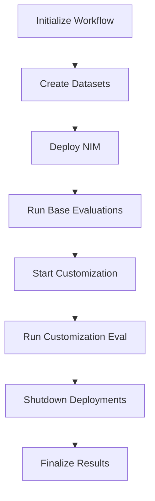
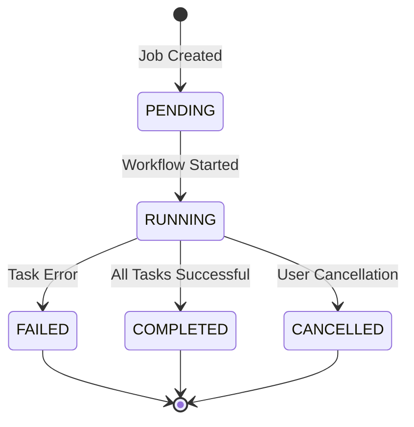

# Task Orchestration and Workflow Management

Learn how the developer example orchestrates complex workflows using Celery for task management, job lifecycle control, and resource cleanup.

## Workflow Architecture

The developer example uses a **Directed Acyclic Graph (DAG)** of Celery tasks to orchestrate the complete flywheel workflow. Each job progresses through multiple stages with automatic error handling and resource cleanup.

### High-Level Workflow Stages



## Task Definitions and Dependencies

### 1. **`initialize_workflow`**
**Purpose**: Sets up the flywheel run, validates configuration, and prepares the job for execution.

**Source**: `src/tasks/tasks.py:104`

**Key Operations**:
- Validates workload_id and client_id
- Initializes database records
- Sets job status to `RUNNING`

**Dependencies**: None (entry point)

```python
# Example task invocation
run_nim_workflow_dag.delay(
    workload_id="customer-service-v1",
    flywheel_run_id="507f1f77bcf86cd799439011",
    client_id="production-app"
)
```

### 2. **`create_datasets`**
**Purpose**: Extracts data from Elasticsearch and creates training/evaluation datasets.

**Source**: `src/tasks/tasks.py:185`

**Key Operations**:
- Queries Elasticsearch for logged interactions
- Validates data format (OpenAI chat completion format)
- Creates evaluation and fine-tuning datasets
- Applies data split configuration
- Uploads datasets to NeMo Data Service

**Dependencies**: `initialize_workflow`

**Dataset Types Created**:
- **Base Evaluation**: Held-out production data for baseline testing
- **Fine-tuning**: Training data for model customization

### 3. **`spin_up_nim`**
**Purpose**: Deploys a NIM model and waits for readiness

**Source**: `src/tasks/tasks.py:342`

**Key Operations**:
- Deploys NIM with specified configuration
- Waits for model readiness

**Dependencies**: `create_datasets`

**Sequential Pattern**: NIMs are deployed one at a time to manage resource allocation and avoid GPU conflicts.

### 4. **`run_base_eval`**
**Purpose**: Runs evaluations against deployed NIMs using F1-score metrics.

**Source**: `src/tasks/tasks.py:474`

**Key Operations**:
- Executes base evaluations on held-out test data
- Calculates F1-scores
- Stores results in database and MLflow (if enabled)

**Dependencies**: `spin_up_nim`


### 5. **`start_customization`**
**Purpose**: Initiates fine-tuning of candidate models using production data.

**Source**: `src/tasks/tasks.py:727`

**Key Operations**:
- Creates customization jobs in NeMo Customizer
- Configures LoRA training parameters
- Monitors training progress
- Handles training failures and retries

**Dependencies**: None (runs in parallel with `run_base_eval`)

**Customization Features**:
- **LoRA Fine-tuning**: Parameter-efficient training
- **Multi-GPU Support**: Distributed training across multiple GPUs
- **Progress Monitoring**: Real-time training progress tracking

### 6. **`run_customization_eval`**
**Purpose**: Evaluates fine-tuned models against base evaluation datasets using F1-score metrics.

**Source**: `src/tasks/tasks.py:874`

**Key Operations**:
- Deploys customized models
- Runs same evaluation as base models
- Calculates F1-scores to compare with base evaluation

**Dependencies**: `start_customization`

### 7. **`shutdown_deployment`**
**Purpose**: Gracefully shuts down NIM deployments to free resources.

**Source**: `src/tasks/tasks.py:925`

**Key Operations**:
- Marks the NIM as completed by updating deployment status in database
- Stops the NIM deployments
- Preserves evaluation results and model artifacts

**Dependencies**: `run_customization_eval`

### 8. **`finalize_flywheel_run`**
**Purpose**: Aggregates results and marks the job as complete.

**Source**: `src/tasks/tasks.py:1004`

**Key Operations**:
- Updates job status to `COMPLETED`

**Dependencies**: `shutdown_deployment`

## Job Lifecycle Management

### Job States and Transitions

**Source**: `src/api/schemas.py` (FlywheelRunStatus enum)



**Note**: Both flywheel runs (FlywheelRunStatus) and individual NIM runs (NIMRunStatus) support CANCELLED states.

### Cancellation Mechanism

**Source**: `src/lib/flywheel/cancellation.py:1-47`

The flywheel implements **graceful cancellation** with automatic resource cleanup:

```python
def check_cancellation(flywheel_run_id: str) -> None:
    """Check if the flywheel run has been cancelled and raise exception if so."""
    # Checks database for cancellation status
    # Raises FlywheelCancelledError to stop task execution
```

**Cancellation Process**:
1. User calls `POST /api/jobs/{id}/cancel`
2. Database marks job as `CANCELLED`
3. All running tasks check cancellation status
4. Tasks raise `FlywheelCancelledError` and exit
5. Cleanup manager removes all resources
6. Job remains in `CANCELLED` state

### Automatic Resource Cleanup

**Source**: `src/lib/flywheel/cleanup_manager.py:1-232`

The cleanup manager automatically handles resource management during:
- Normal workflow completion
- Job cancellation
- System shutdown
- Worker crashes

**Cleanup Operations**:
```python
class CleanupManager:
    def cleanup_all_running_resources(self):
        """Main cleanup procedure for all running resources."""
        # 1. Find all running flywheel runs
        # 2. Clean up each flywheel run
        # 3. Clean up customization configs
        # 4. Report cleanup results
```

## Monitoring and Observability

### Celery Task Monitoring

**Flower Web UI**: Available at `http://localhost:5555` during development

**Key Metrics to Monitor**:
- **Active Tasks**: Currently executing tasks
- **Task Queue Length**: Pending tasks waiting for workers
- **Task Success/Failure Rate**: Overall workflow reliability
- **Resource Utilization**: Worker CPU and memory usage

### Database Monitoring

**Job Progress Tracking**:
```python
# Query job status
db.flywheel_runs.find_one({"_id": ObjectId(job_id)})

# Monitor NIM deployments and evaluations
db.nims.find({"flywheel_run_id": job_id})

# Check evaluation results
db.evaluations.find({"nim_id": nim_id})
```

**Key Collections**:
- `flywheel_runs`: Overall job status and metadata
- `nims`: NIM deployment and evaluation status
- `evaluations`: Individual evaluation results and metrics
- `customizations`: Model customization job tracking

### Logging Configuration

**Source**: `src/log_utils.py`

Structured logging with configurable levels:
```python
logger = setup_logging("data_flywheel.tasks")
logger.info(f"Starting workflow for job {flywheel_run_id}")
logger.error(f"Task failed: {error_message}")
```

## Troubleshooting Common Issues

### Task Failure Scenarios

#### 1. **Data Validation Failures**
**Symptoms**: Job fails during `create_datasets` stage
**Causes**: 
- Insufficient data in Elasticsearch
- Invalid OpenAI format in logged data
- Missing required fields (workload_id, client_id)

**Solution**:
```bash
# Check data quality
curl "http://localhost:9200/flywheel/_search" | jq '.hits.hits[0]._source'

# Validate data format by loading (validation happens automatically)
python src/scripts/load_test_data.py --workload-id test-validation --file data/aiva-test.jsonl
```

#### 2. **NIM Deployment Failures**
**Symptoms**: Job fails during `spin_up_nim` stage
**Causes**:
- Insufficient GPU resources
- Network connectivity issues
- Invalid model configurations

**Solution**:
```bash
# Check GPU availability
nvidia-smi

# Verify NeMo connectivity
curl "http://nemo.test/v1/models"

# Check Kubernetes resources
kubectl get pods -n dfwbp
```

#### 3. **Evaluation Timeouts**
**Symptoms**: Tasks hang during evaluation stages
**Causes**:
- Large dataset size
- Slow model inference
- Network latency to remote services

**Solution**:
```yaml
# Increase task timeout in config
celery_config:
  task_time_limit: 7200  # 2 hours
  task_soft_time_limit: 6600  # 1.8 hours
```

### Recovery Procedures

#### Manual Task Recovery
```python
# Cancel stuck job
POST /api/jobs/{job_id}/cancel

# Clean up resources manually
from src.lib.flywheel.cleanup_manager import CleanupManager
cleanup = CleanupManager(db_manager)
cleanup.cleanup_all_running_resources()
```

#### Database Consistency Check
```python
# Find orphaned resources
db.nims.find({"status": "running", "flywheel_run_id": {"$nin": active_jobs}})

# Reset stuck jobs
db.flywheel_runs.update_many(
    {"status": "running", "started_at": {"$lt": cutoff_time}},
    {"$set": {"status": "failed", "error": "Timeout recovery"}}
)
```

