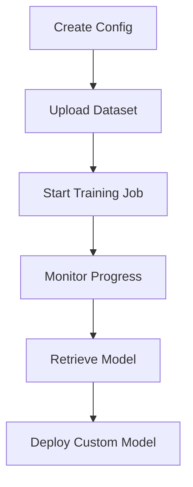

# NeMo Platform Integration Deep Dive

Learn how to leverage advanced NeMo Microservices Platform capabilities for model customization, evaluation, and deployment within the developer example.

## NeMo Services Integration Overview

The developer example integrates with five core NeMo services:

- **NeMo Customizer**: Fine-tuning and model adaptation
- **NeMo Evaluator**: Comprehensive model evaluation  
- **NeMo Deployment Manager (DMS)**: Model deployment and serving

### Service Configuration

**Note**: The default `config/config.yaml` contains development/test URLs. For production deployment, update with your actual service endpoints.

**Development Configuration** (`config/config.yaml:1-10`):
```yaml
nmp_config:
  nemo_base_url: "http://nemo.test"     # Development endpoint
  nim_base_url: "http://nim.test"       # Development endpoint
  datastore_base_url: "http://data-store.test"  # Development endpoint
  nmp_namespace: "dfwbp"
```

**Production Configuration Example**:
```yaml
nmp_config:
  nemo_base_url: "http://nemo-service.your-cluster"
  nim_base_url: "http://nim-service.your-cluster"  
  datastore_base_url: "http://data-store.your-cluster"
  nmp_namespace: "your-namespace"
```

## NeMo Customizer Integration

**Source**: `src/lib/nemo/customizer.py:1-441`

The Customizer service enables fine-tuning of foundation models using your production data with parameter-efficient techniques like LoRA.

### Customization Workflow



### Configuration Management

**Creating Customizer Configurations**:
```python
def create_customizer_config(
    self,
    base_model: str,
    customizer_config: CustomizerConfig,
    training_config: TrainingConfig,
) -> str:
    """Creates a reusable customization configuration."""
    
    config_name = NIMConfig.generate_config_name(base_model)
    
    config_payload = {
        "name": config_name,
        "namespace": self.namespace,
        "target": customizer_config.target,
        "training_options": [{
            "training_type": training_config.training_type,
            "finetuning_type": training_config.finetuning_type,
            "num_gpus": customizer_config.gpus,
            "num_nodes": customizer_config.num_nodes,
            "tensor_parallel_size": customizer_config.tensor_parallel_size,
            "data_parallel_size": customizer_config.data_parallel_size,
            "use_sequence_parallel": customizer_config.use_sequence_parallel,
            "micro_batch_size": customizer_config.micro_batch_size,
        }],
        "training_precision": customizer_config.training_precision,
        "max_seq_length": customizer_config.max_seq_length,
    }
```

### Training Job Management

**Starting Training Jobs**:
```python
def start_training_job(
    self,
    name: str,
    base_model: str,
    output_model_name: str,
    dataset_name: str,
    training_config: TrainingConfig,
    nim_config: NIMConfig,
) -> tuple[str, str]:
    """Initiates a fine-tuning job and returns job_id and config_name."""
    
    # Create or get the config name
    config_name = self.create_customizer_config(base_model, nim_config.customizer_configs, training_config)
    
    training_params = {
        "name": name,
        "output_model": f"{self.namespace}/{output_model_name}",
        "config": f"{self.namespace}/{config_name}",
        "dataset": {"name": dataset_name, "namespace": self.namespace},
        "hyperparameters": {
            "training_type": training_config.training_type,
            "finetuning_type": training_config.finetuning_type,
            "epochs": training_config.epochs,
            "batch_size": training_config.batch_size,
            "learning_rate": training_config.learning_rate,
            "lora": {
                "adapter_dim": training_config.lora.adapter_dim,
                "adapter_dropout": training_config.lora.adapter_dropout,
            },
        },
    }
```

## NeMo Evaluator Integration

**Source**: `src/lib/nemo/evaluator.py:1-500`

The Evaluator service provides comprehensive model assessment capabilities with multiple evaluation types and metrics.

### Evaluation Execution Patterns

**Required Imports**:
```python
from src.lib.nemo.evaluator import Evaluator
from src.api.models import WorkloadClassification, ToolEvalType
```

**Parallel Evaluation Strategy**:
```python
def run_comprehensive_evaluation(nim_config: dict, datasets: dict, workload_type: WorkloadClassification) -> list:
    """Run multiple evaluation types in parallel."""
    
    # Initialize evaluator with judge model config
    evaluator = Evaluator(judge_model_config=judge_config)
    eval_job_ids = []
    
    # Base accuracy evaluation
    job_id = evaluator.run_evaluation(
        dataset_name=datasets["base"],
        workload_type=workload_type,
        target_model=nim_config["model_name"],
        test_file="eval_data.jsonl"
    )
    eval_job_ids.append(job_id)
    
    return eval_job_ids
```

## NeMo Deployment Manager (DMS) Integration

**Source**: `src/lib/nemo/dms_client.py:1-179`

The DMS client manages NVIDIA Inference Microservice (NIM) deployments for serving models.

### NIM Deployment Configuration

**Standard Deployment**:
```python
def deploy_model(self) -> dict[str, Any] | None:
    """Deploy a model using the DMS API."""
    
    url = f"{self.nmp_config.nemo_base_url}/v1/deployment/model-deployments"    
    payload = self.nim.to_dms_config()
    response = requests.post(url, json=payload)
    
    # Bug in DMS API, if the model deployment already exists, it will return a 500
    if "model deployment already exists" in response.text:
        return
    else:
        response.raise_for_status()
        return response.json()
```

### Advanced Deployment Patterns

**Multi-Model Serving**:
```yaml
nims:
  - model_name: "meta/llama-3.2-1b-instruct"
    model_type: "llm"
    context_length: 8192
    gpus: 1
    pvc_size: 25Gi
    tag: "1.8.3"
    customization_enabled: true
    customizer_configs:
      target: "meta/llama-3.2-1b-instruct@2.0"
      gpus: 1
      max_seq_length: 8192
    
  # - model_name: "meta/llama-3.2-3b-instruct"  
  #   model_type: "llm"
  #   context_length: 8192
  #   gpus: 2
  #   customization_enabled: true
```

**Deployment Status Checking**:
```python
def get_deployment_status(self) -> str:
    """Get the status of a model deployment."""
    
    response = self._call_deployment_endpoint()
    response.raise_for_status()
    return response.json()["status_details"]["status"]

def is_deployed(self) -> bool:
    """Check if a model is deployed."""
    try:
        return self.get_deployment_status() == "deployed"  # Note: wait_for_deployment checks for "ready"
    except Exception:
        return False
```

### Deployment Lifecycle Management

**Health Checking**:
```python
def wait_for_deployment(
    self,
    flywheel_run_id: str,
    progress_callback: Callable[[str], None] | None = None,
    timeout: int = 3600,
):
    """Wait for a deployment to complete.

    Args:
        flywheel_run_id: Unique identifier for the flywheel run
        progress_callback: Optional callback function to report progress.
        timeout: Maximum time to wait in seconds (default: 3600)
    """
    
    start_time = time.time()
    while time.time() - start_time < timeout:
        check_cancellation(flywheel_run_id)
        
        status = self.get_deployment_status()
        
        if status == "ready":
            return status
        elif status == "failed":
            raise Exception("Deployment failed")
            
        time.sleep(30)
```

## NeMo Data Service Integration

**Source**: `src/lib/nemo/data_uploader.py:1-346`

The Data Service manages datasets for training and evaluation workflows.

### Dataset Upload Patterns

**Structured Data Upload**:
```python
def upload_file(
    self,
    data_fp: str,
    data_type: str,
) -> str:
    """Upload a single data file to the repository."""
    
    # Validate data type
    valid_types = ["training", "validation", "testing"]
    assert data_type in valid_types, f"data_type must be one of {valid_types}"
    
    # Validate file exists
    assert os.path.exists(data_fp), f"Data file at '{data_fp}' does not exist"
    
    # Create namespaces if not already done
    if not hasattr(self, "repo_id"):
        self._create_namespaces()
        self.repo_id = self._create_repo()
    
    # Determine filename in repo
    filename = os.path.basename(data_fp)
```

### Dataset Validation and Quality Control

**OpenAI Format Validation**:
```python
from src.lib.integration.openai_format_validator import OpenAIFormatValidator

def validate_records(conversation: dict) -> bool:
    """Validate OpenAI chat completion format."""
    validator = OpenAIFormatValidator()
    return validator.validate_chat_completion_format(conversation)
```

## Integration Best Practices

> **Note**: The following sections contain example implementations and patterns for advanced NeMo integration. These are illustrative code samples that demonstrate best practices rather than functions available in the current codebase.

### Error Handling and Resilience

**Retry Logic with Exponential Backoff** *(Example Implementation)*:
```python
def resilient_nemo_request(func, max_retries=3):
    """Execute NeMo API calls with retry logic."""
    
    for attempt in range(max_retries):
        try:
            return func()
        except requests.exceptions.ConnectionError:
            if attempt == max_retries - 1:
                raise
            delay = (2 ** attempt) + random.uniform(0, 1)
            time.sleep(min(delay, 30))
        except requests.exceptions.HTTPError as e:
            if e.response.status_code in [429, 503]:  # Rate limit or service unavailable
                time.sleep(60 * (attempt + 1))
            else:
                raise
```

## Troubleshooting NeMo Issues

### Common Integration Problems

#### 1. **Service Connectivity Issues**

**Symptoms**: Timeouts or connection refused errors
**Solution**:
```bash
# Test service connectivity
curl -v "http://nemo-service/v1/health"

# Check Kubernetes service discovery
kubectl get svc -n nemo-namespace

# Verify network policies
kubectl describe networkpolicy -n nemo-namespace
```

#### 2. **Authentication Failures**

**Symptoms**: 401/403 HTTP errors
**Solution**:
```bash
# Verify NGC API key
echo $NGC_API_KEY | base64 -d

# Check Kubernetes secrets
kubectl get secret ngc-api -o yaml

# Test authentication manually
curl -H "Authorization: Bearer $NGC_API_KEY" "http://nemo-service/v1/models"
```

#### 3. **Resource Allocation Problems**

**Symptoms**: Training jobs fail with OOM or insufficient GPU errors
**Solution**:
```bash
# Check GPU availability
nvidia-smi

# Monitor Kubernetes resource usage
kubectl top nodes
kubectl describe node <node-name>

# Adjust resource requests
kubectl patch deployment <deployment> -p '{"spec":{"template":{"spec":{"containers":[{"name":"<container>","resources":{"requests":{"nvidia.com/gpu":"2"}}}]}}}}'
```

### Performance Optimization Strategies

#### 1. **Training Optimization**

```python
# Optimize training parameters for speed vs. quality
training_config = {
    "micro_batch_size": 8,      # Larger batches for better GPU utilization
    "batch_size": 16,           # Training batch size
    "learning_rate": 3e-4,      # Aggressive learning rate
    "epochs": 3,                # Fewer epochs for faster iteration
    "training_type": "sft",     # Supervised fine-tuning
    "finetuning_type": "lora",  # LoRA fine-tuning
}
```

#### 2. **Evaluation Optimization**

```python
# Batch evaluation requests for efficiency (Example Implementation)
def batch_evaluation_requests(items: list, batch_size: int = 32):
    """Process evaluation requests in batches."""
    
    for i in range(0, len(items), batch_size):
        batch = items[i:i + batch_size]
        yield run_evaluation_batch(batch)
```

This comprehensive integration guide enables advanced usage of NeMo services within the developer example. For basic configuration, refer to the [Configuration Guide](./03-configuration.md). 