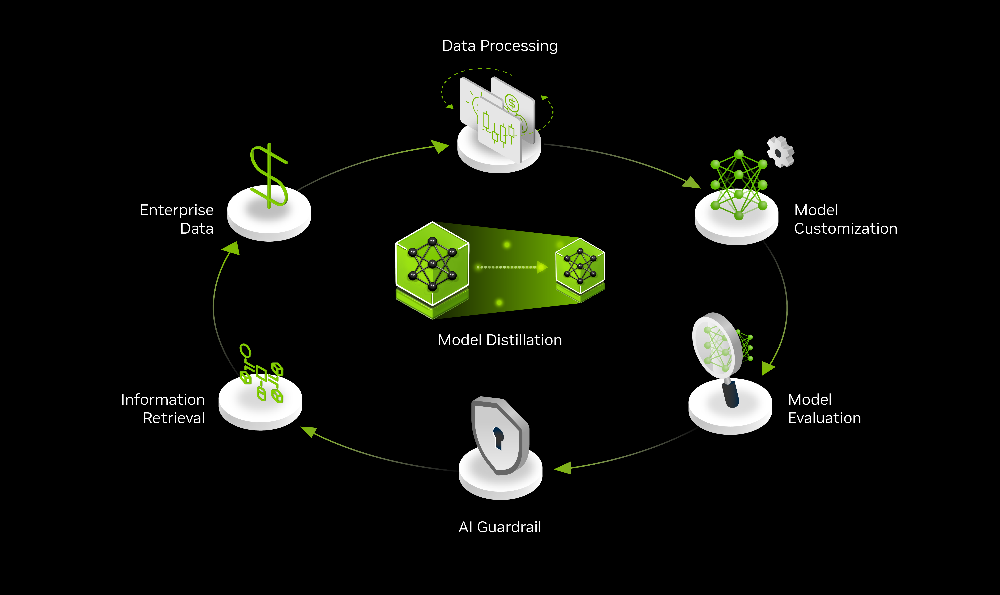

# AI Model Distillation for Financial Data

## Introduction

A data flywheel creates a self-reinforcing loop where user interactions continuously enhance the AI application. As users engage, their input helps identify more efficient models (or NIMs) that achieve comparable accuracy, reducing the total cost of ownership. Additionally, these interactions can help improve or maintain model accuracy, leading to better responses and contribute to the ongoing generation of higher-quality data.



This notebook demonstrates how to use a data flywheel to distill knowledge from a large teacher model into smaller, more efficient student models for financial news classification. Key steps include generating high-quality labels using a teacher model, processing the data, fine-tuning smaller candidate models, and evaluating their performance to match teacher-level accuracy.

## How it Works

The Data Flywheel Blueprint provides a unified API (the Orchestrator) that abstracts away the complexity of directly managing [NVIDIA NeMo Microservices](https://docs.nvidia.com/nemo/microservices/latest/about/index.html). As a user, you interact only with the Data Flywheel Orchestrator API to:

- Launch new flywheel jobs (for fine-tuning, evaluation, and deployment of models)
- Monitor job progress and results
- Access evaluation metrics and customization status

**What happens under the hood:**  

When you submit a job via the Orchestrator API, the system:
- Retrieves and processes your data (e.g., from Elasticsearch)
- Creates and uploads datasets for training, evaluation, and validation
- Deploys and manages candidate models (NIMs) on the NeMo platform
- Runs evaluations (including LLM-as-a-judge if configured)
- Handles model customization and tracks progress
- Aggregates results and exposes them through the same API

All direct communication with the NeMo Microservices platform (model deployment, evaluation, customization, etc.) is handled by the orchestrator's backend services. This means you do not need to interact with NeMo APIs or infrastructure directly—the orchestrator manages the full workflow for you.

## Notebook

- [AI Model Distillation for Financial Data](./ai-model-distillation-financial-data.ipynb): Use a teacher model to label financial news headlines and fine-tune smaller models to achieve comparable accuracy for event classification.

## Prerequisites

### Hardware Requirement

To complete this tutorial, you'll need a system with at least two A100 or H100 (80GB) NVIDIA GPUs, which will be used as follows:

- **Fine-tuning:** At least one GPU is required for fine-tuning a model (e.g. `meta/llama-3.2-1b-instruct`, `meta/llama-3.2-3b-instruct` or `meta/llama-3.1-8b-instruct`).
- **Inference:** At least one GPU is required for deploying the corresponding NIM for evaluation.

### Software Requirement

You will deploy the [NVIDIA NeMo Microservices](https://docs.nvidia.com/nemo/microservices/latest/about/index.html) as part of this blueprint.

First, please ensure your platform meets the [Requirements](https://docs.nvidia.com/nemo/microservices/latest/get-started/platform-prereq.html#requirements) before proceeding. The notebook uses a script to automate the remaining setup, including the minikube cluster and NeMo microservices deployment.


### Get the Data Flywheel Blueprint

1. Clone the blueprint repository:

   ```sh
   git clone git@github.com:NVIDIA-AI-Blueprints/ai-model-distillation-for-financial-data.git

   cd ai-model-distillation-for-financial-data
   ```

2. Install dependencies using [uv](https://docs.astral.sh/uv/getting-started/installation/):

   ```sh
   uv sync --dev
   ```

### Access the Tutorial

1. Launch Jupyter Lab to begin working with the provided tutorial.

   ```bash
   uv run --with jupyter jupyter lab --ip=0.0.0.0
   ```

2. Navigate to the [notebook](#notebooks).
