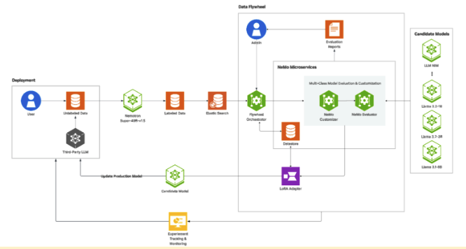

# NVIDIA AI Model Distillation for Financial Data

## Introduction

The AI Model Distillation for Financial Data developer example provides a workflow for creating, evaluating, and deploying high-performance, domain-specific models in financial services. Built with NVIDIA NeMo and NIM, it enables continuous distillation, fine-tuning, and evaluation on real financial data, maintaining accuracy while reducing compute costs.



With a self-reinforcing data flywheel, these models are iteratively distilled and domain-adapted on production datasets, enabling rapid backtesting, strategy evaluation, and accelerated experimentation.

## How it Works

We provide a reusable recipe to experiment and train these distilled models using the [NVIDIA Data Flywheel Blueprint](https://github.com/NVIDIA-AI-Blueprints/data-flywheel). At the heart of the blueprint is the flywheel orchestrator, a unified control plane that abstracts the complexity of interacting directly with NVIDIA NeMo microservices. Acting as the brain of the flywheel system, the orchestrator API coordinates the data flywheel job by leveraging a suite of modular [NeMo microservices](https://docs.nvidia.com/nemo/microservices/latest/index.html): 
- NVIDIA NeMo Customizer to handle lightweight LoRA-based fine-tuning
- NVIDIA NeMo Evaluator to automate evaluations across runs
- NeMo Datastore to manage structured datasets and artifacts
- NeMo Deployment Manager to spin up and serve candidate distilled models dynamically for inference

Each microservice is packaged as a Docker container for consistent deployment across different environments. This workflow is orchestrated through Kubernetes integration. It ensures dynamic orchestration of NIM microservices for experimentation and production workloads.

All direct communication with the NeMo Microservices platform (model deployment, evaluation, customization, etc.) is handled by the orchestrator's backend services. This means you do not need to interact with NeMo APIs or infrastructure directly—the orchestrator manages the full workflow for you.

## Notebooks

Check out the following example notebooks to learn how to distill LLMs using a data flywheel for domain-specific applications.

- [AI Model Distillation for Financial Data developer example](./ai-model-distillation-financial-data.ipynb): Distil, evaluate and deploy a domain-spcific, cost efficient model.

## Prerequisites

### Hardware Requirement

To complete this tutorial, you'll need a system with at least two A100/H100/H200/B200 (80GB) NVIDIA GPUs, which will be used as follows:

- **Fine-tuning:** At least one GPU is required for fine-tuning a model (e.g.`meta/llama-3.2-1B-instruct`, `meta/llama-3.2-3B-instruct` or `meta/llama-3.1-8B-instruct`).
- **Inference:** At least one GPU is required for deploying the corresponding NIM for evaluation.

### Software Requirement

You will deploy the [NVIDIA NeMo Microservices](https://docs.nvidia.com/nemo/microservices/latest/about/index.html) as part of this developer example.

First, please ensure your platform meets the [Requirements](https://docs.nvidia.com/nemo/microservices/latest/get-started/platform-prereq.html#requirements) before proceeding. The notebook uses a script to automate the remaining setup, including the minikube cluster and NeMo microservices deployment.


### Get the AI Model Distillation for Financial Data developer example

1. Clone the blueprint repository:

   ```sh
   git clone git@github.com:NVIDIA-AI-Blueprints/ai-model-distillation-for-financial-data.git

   cd ai-model-distillation-financial-data
   ```

2. Install dependencies using [uv](https://docs.astral.sh/uv/getting-started/installation/):

   ```sh
   uv sync --dev
   ```

### Access the Tutorial

1. Launch Jupyter Lab to begin working with the provided tutorial.

   ```bash
   uv run --with jupyter jupyter lab --ip=0.0.0.0
   ```

2. Navigate to the [notebook](#notebooks).
